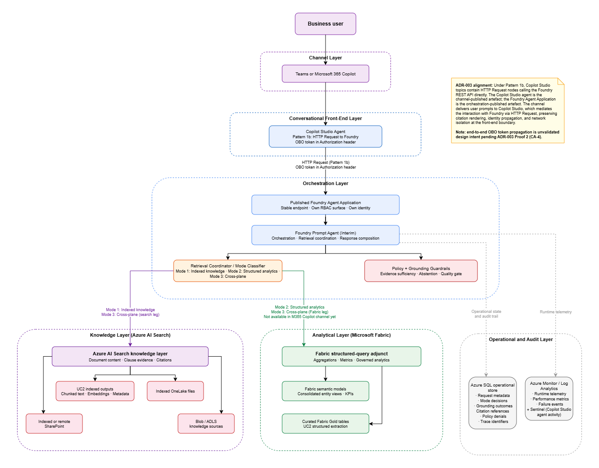
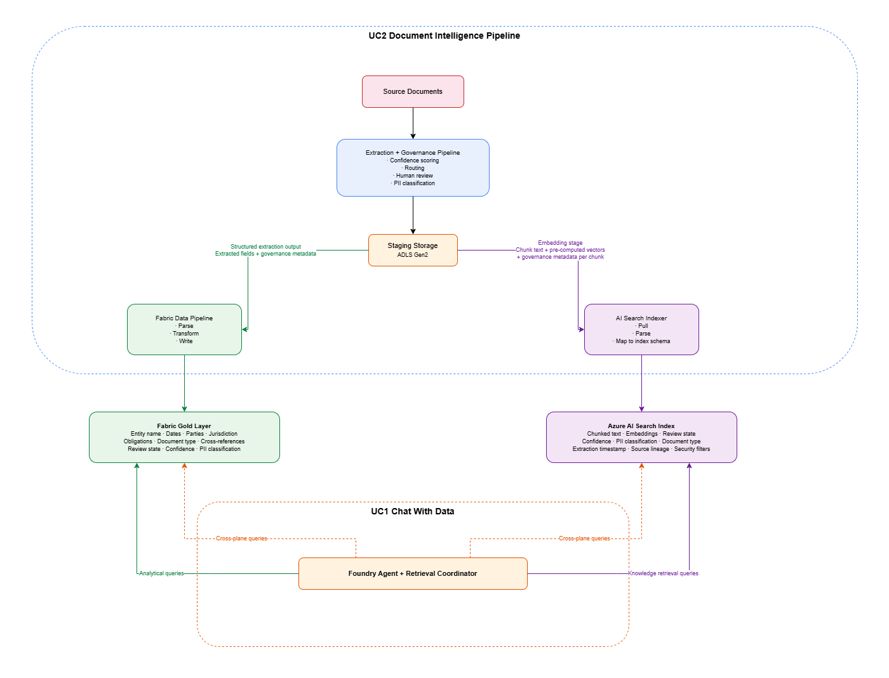
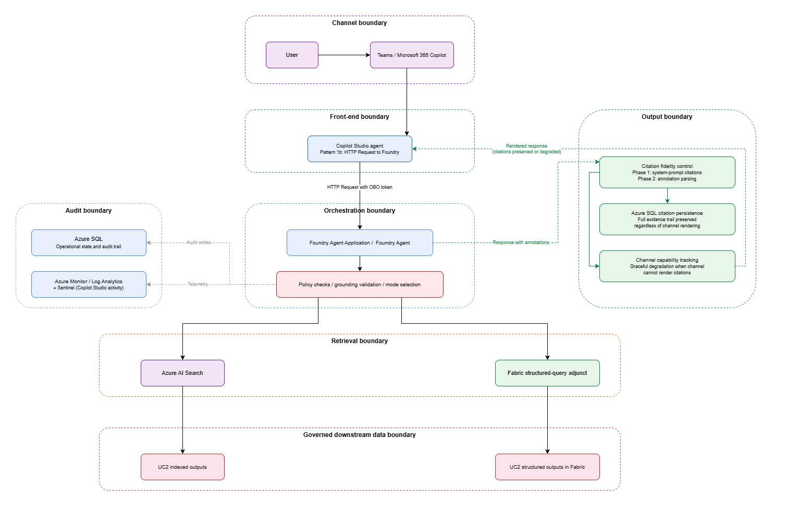

# UC1: Chat with Data --- Reference Architecture

**Status:** Draft  
**Date:** 03/04/2026 (last updated)  
**Repository:** `docs/02-architecture/use-cases/uc1-chat-with-data/reference-architecture.md`  
**Platform dependency:** This use case deploys on the shared Enterprise AI Platform. See the [Enterprise AI Platform reference architecture](../../platform/reference-architecture.md).

---

> **Note:** This is a reference architecture for a governed conversational system over enterprise data on the Microsoft stack. It is not a product and it is not designed for a specific organisation.
> 
> The patterns, decision records, and component choices are intended to be adapted to a specific context: the source systems, governance requirements, document types, retrieval patterns, and operational constraints of the organisation using it inform the final design. It is there for teams to reference, test ideas against, or use parts of it in their own context.
> 
> This architecture is actively evolving. Diagrams, workflows, and component details reflect current design decisions and will be refined as the system is built and validated against production constraints. Structural changes will be captured in updated ADRs.

---

## Context

UC1 addresses a common enterprise problem that is adjacent to, but not identical with, document intelligence. Once the organisation has invested in extracting, staging, indexing, and governing information, users still need a safe way to ask questions across that governed data estate. They want to ask questions in natural language, but they do not all need the same thing, because the governed data estate itself contains fundamentally different kinds of information.

UC2 produces two distinct categories of downstream output from the same source documents, and understanding this duality is essential to understanding why UC1's architecture takes the shape it does.

The first category is **structured extraction**: discrete fields pulled from enterprise documents and written to Delta tables in the Fabric Lakehouse Gold layer. Entity names, effective dates, parties, jurisdiction, obligations, document type, cross-references to related documents. These are tabular, queryable, joinable with other Fabric data. They have passed through UC2's full governance pipeline (confidence scoring, routing evaluation, optional agentic validation, human review where required, PII classification) and represent governed, validated, derived analytical truth. They feed consolidated entity views, Power BI reporting, and downstream system integrations. Some questions are fundamentally **analytics questions** that should be answered from this structured data:

- What are the key dates for Entity X's active agreements?
- Which counterparties have the highest concentration of obligations expiring this quarter?
- How many reviewed documents still have missing required clauses?

The second category is **indexed document content**: the actual text of the source documents, the specific clause language, the negotiated or prescribed terms, the exact wording of rights and obligations, the precise phrasing of liability provisions, the amendments or addenda that modified specific sections of a governing document. This content does not reduce to structured fields. UC2 extracts key fields from it, but those fields are a summary of the document, not a replacement for it. This content is chunked, embedded, and indexed in Azure AI Search as part of UC2's staging-to-indexer path. Some questions are fundamentally **grounded retrieval questions** that can only be answered from this indexed document content:

- Which clause supports the date you just gave me?
- Show the exact wording of the liability provision for Entity X.
- What changed in the most recent amendment to the governing document?

There is a third category of question that spans both planes. **Cross-plane questions** require structured analytical context from Fabric and document-level evidence from AI Search in the same answer:

- "Entity X has three agreements expiring in Q1 2027. What are the renewal terms in each?"

The first part (which agreements expire) is an aggregation query over structured Gold-layer data. The second part (what are the renewal terms) requires retrieval of specific clauses from the indexed document content. Neither plane can answer the full question alone.

These are not the same architecture problem. Fabric semantic assets are strong at governed analytics. Azure AI Search is strong at cross-source retrieval and grounding over indexed content. Fabric is not a search engine: it does not do semantic similarity matching, vector search, hybrid keyword-plus-vector retrieval with relevance ranking, or passage-level citation back to source documents. Azure AI Search is not an analytics engine: it does not do aggregation, metric computation, or semantic-model-driven KPI queries with row-level and column-level security. UC1 therefore cannot be designed as "one tool to do everything" without weakening either answer quality or governance.

The governance models are also different. The structured extraction in Fabric is governed as validated summary data: derived, confidence-scored, human-reviewed where required. The document content in AI Search retains the original text, governed through a retrieval-focused model with document-level security and citation integrity. When a user retrieves a clause from AI Search, they are reading the original document content. When they query a Gold table, they are reading a derived, validated summary. Both are valuable. Both need governance. But the governance mechanisms are different, and keeping them in their appropriate platforms makes the control story cleaner.

UC1 also cannot be treated as independent from UC2. UC2 already transforms raw documents into these two categories of governed downstream artefacts. UC1's job is to provide a conversational interface over those artefacts, not to recreate the extraction pipeline or bypass the controls that UC2 introduced.

> UC1 is not limited to UC2 outputs. The conversational system is designed as a governed interface over an extensible knowledge estate. UC2 is the first and most architecturally significant source because it produces both structured extraction and indexed document content, which is why the dual-plane architecture exists.
> 
> Additional knowledge sources, whether indexed SharePoint libraries, OneLake files, Blob and ADLS document stores, policy repositories, operational procedure manuals, regulatory guidance, or any other governed content that can be indexed in Azure AI Search or surfaced through Fabric, can be onboarded through the same retrieval planes without architectural change. The Logical View diagram already reflects this: the Azure AI Search knowledge layer lists UC2 indexed outputs, OneLake files, SharePoint, and Blob/ADLS as separate sources.
> 
> Each new source must meet the same governance requirements (document-level security, freshness targets, content quality) before it is approved for retrieval. The onboarding decision for each source is a governance decision, not a technical integration problem.

This document describes the **use-case-specific architecture** for UC1. It inherits the shared runtime, identity, encryption, networking, and monitoring assumptions from the shared platform reference architecture and builds directly on UC2 outputs in both Fabric and Azure AI Search.

---

## Scope

### In scope

- Conversational querying over governed enterprise data and indexed knowledge
- Reuse of UC2 outputs in Microsoft Fabric and Azure AI Search
- Foundry-based conversational orchestration for the target-state design
- Azure AI Search as the default reusable retrieval layer for indexed and document-derived content
- Optional governed structured-query path for Fabric-native analytical questions
- Identity-aware retrieval and permission propagation
- Source attribution, grounding validation, and audit-friendly response behavior
- Microsoft Teams and Microsoft 365 Copilot as delivery channels, with channel readiness gated by documented platform limitations
- Copilot Studio as the conversational front-end calling Foundry Agent Service via HTTP Request (Pattern 1b per UC1-ADR-003), with phased dual-channel rollout
- Operational logging, quality controls, and governance boundaries for enterprise production use
- Onboarding additional governed knowledge sources into the Azure AI Search knowledge layer or Fabric analytical plane beyond UC2, subject to per-source governance approval

### Out of scope

- Replacing the UC2 extraction, confidence-routing, or human-review workflow
- Designing a client-specific ontology or semantic model implementation in Fabric
- Implementing a general-purpose custom web portal for UC1 in this phase
- Detailed index schemas, prompt templates, or UI wireframes
- Formal legal interpretation or fully autonomous decision making
- Final Microsoft 365 Copilot declarative-agent modeling choices that could not be confirmed from first-party sources in this environment
- UC3 contract-comparison workflows and UC4 audit workflows, except where they are future consumers of the same knowledge layer

---

## Design Goals

- **Reuse governed downstream outputs instead of bypassing them.** UC1 must consume the artefacts that UC2 already governs, not query extraction internals or raw workflow state.
- **Keep retrieval modes explicit.** The architecture must distinguish between live structured analytics and indexed knowledge retrieval instead of forcing one platform to masquerade as both.
- **Preserve authorization end-to-end.** User identity and access-control semantics must be enforced across Fabric, Azure AI Search, and the conversational orchestration layer.
- **Treat grounding as a control boundary.** Answers must be supported by retrieval evidence, and the architecture must be able to detect when evidence is weak, conflicting, or unavailable.
- **Make operational truth durable.** Session metadata, policy decisions, retrieval mode selection, and response lineage should be observable and auditable beyond transient runtime state.
- **Prefer GA building blocks where possible.** Preview capabilities can be used selectively, but the architecture should not depend on them unless their value is explicit and accepted.
- **Support phased rollout.** The architecture should permit a Fabric-native pilot without precluding the long-term Foundry + Azure AI Search target state.
- **Treat delivery channel selection as a governance decision.** Channel convenience must not silently override citation fidelity, identity propagation, or network isolation posture (UC1-ADR-003).
- **Support extensible knowledge onboarding.** The architecture must allow additional governed knowledge sources to be onboarded into the retrieval planes without requiring structural changes to the orchestration, grounding, or audit layers. Each new source must meet the same governance, security, and freshness requirements as UC2 outputs.

---

## Relationship to the Shared Platform

UC1 is not a separate platform. It reuses the platform's:

- Microsoft Foundry resource and model deployment posture
- Azure AI Search tenancy and managed identity posture
- Azure SQL operational data-store pattern
- Azure Monitor / Log Analytics observability model
- Microsoft Fabric integration model
- managed-identity and Entra-first security posture
- private-by-default network boundary where supported by service integrations
- CMK/MMK and EU data-residency controls

This document does not restate the shared platform in full. It explains how UC1 uses it.

The most important shared-platform implication for UC1 is that **delivery channel convenience cannot silently override platform controls**. If a Teams or Microsoft 365 Copilot publication path removes citations, bypasses Private Link, or weakens permission enforcement, that is an architectural decision point, not a minor product footnote. UC1-ADR-003 formalises this principle by requiring explicit go/no-go criteria for each channel before production rollout.

---

## Relationship to UC2

UC2 is a first-class upstream dependency for UC1.

UC2 already produces two categories of governed downstream output from the same source documents:

- **Structured extraction in Fabric**: discrete fields written to Gold-layer Delta tables through the full governance pipeline (confidence scoring, routing, human review, PII classification). These carry governance metadata as governed columns alongside the extracted fields.
- **Indexed document content in Azure AI Search**: chunked document text with vector embeddings, populated by the AI Search indexer pulling structured chunk documents from UC2's staging storage. Each chunk document carries governance metadata (source lineage, review state, confidence, PII classification, extraction timestamp, security filters) as first-class filterable and retrievable fields in the index schema.

UC1 is a read-only downstream consumer of both stores. It does not operate its own extraction, chunking, embedding, or indexing pipeline. The governance metadata that UC2 attaches to both stores is available to UC1 at query time and influences how answers are qualified, cited, and audited. See UC1-ADR-008 for the consumption decision and governance metadata handling rules.

UC1 must therefore:

- consume the **governed downstream representations** of UC2 outputs,
- preserve or reinterpret **governance metadata** where needed,
- and never turn Azure AI Search or Fabric into a bypass around UC2 controls.

---

## Architectural Position

The target-state design selects:

- **Foundry Agent Service** as the primary orchestration layer,
- **Copilot Studio** as the conversational front-end and channel publication surface, calling the Foundry agent via HTTP Request (Pattern 1b per UC1-ADR-003),
- **Azure AI Search** as the default reusable knowledge layer for indexed content and document-derived outputs,
- **Fabric semantic assets** as the authoritative analytical plane,
- and a **governed structured-query adjunct** for live Fabric questions that should not be forced through search.

The Foundry orchestration layer is architecturally a **defined multi-step workflow**, not a single-agent-with-tools problem. UC1's request lifecycle is a sequence of discrete steps with explicit branching, policy gates, and audit writes at defined points: mode classification, policy checks, retrieval (one or both planes, potentially in parallel), grounding validation, response composition, citation formatting, and audit recording. The Retrieval Coordinator, Mode Classifier, and Policy and Grounding Guardrails are not just logical components inside a single agent's reasoning; they are discrete workflow steps that should eventually be separate nodes in the orchestration graph. The architecture describes these as explicit workflow steps regardless of whether the current implementation collapses them into a single Prompt Agent's tool-calling behaviour or expresses them as separate nodes in a Foundry Workflow Agent.

The **target-state orchestration** for UC1 is a Foundry Workflow Agent (or equivalent declarative multi-step orchestration) published as a single agent endpoint. Workflow agents support the pattern UC1 needs: sequential steps, branching logic for mode classification and grounding validation, variable handling for passing evidence packages between steps, the ability to invoke different agents or tools at different steps, and private networking. However, workflow agents remain preview as of March 2026. The **interim implementation** therefore uses a Foundry Prompt Agent, which is GA, to implement the same workflow steps through tool-calling and system-prompt-driven orchestration. This is an explicit trade-off: the Prompt Agent collapses UC1's multi-step workflow into implicit tool-calling behaviour, which makes mode classification, policy enforcement, and grounding validation harder to audit because they happen inside the agent's reasoning rather than as discrete, observable workflow steps. The architecture is designed so that the transition from Prompt Agent to Workflow Agent is a migration of orchestration logic into declarative workflow nodes, not a redesign of the workflow itself. See CA-5 in Open Architectural Decisions for the decision tracking.

This target state implements a two-layer delivery model. Copilot Studio owns user-facing conversation and channel publication (Teams, M365 Copilot). Foundry Agent Service owns orchestration, retrieval, and response generation. The integration method between these two layers is a first-order architectural decision (UC1-ADR-003) because it determines whether citations, identity, and network isolation survive the boundary between the conversational front-end and the orchestration backend. Under Pattern 1b, Copilot Studio topics contain HTTP Request nodes that call the Foundry REST API directly, passing the user's OBO token in the Authorization header. The Copilot Studio agent is the channel-published artefact; the Foundry Agent Application is the orchestration-published artefact.

Both the Azure AI Search knowledge layer and the Fabric analytical plane are **architecturally required**, not alternatives where one might replace the other. They are required because UC2 produces two fundamentally different downstream output categories from the same source documents, each serving distinct query patterns through distinct governance models. UC1 must consume both to function as a genuine knowledge assistant rather than just an analytics chatbot or a document search tool.

While UC2 outputs are the initial and primary content for both planes, the architecture is not coupled to UC2 as the sole source. Any governed content that meets the retrieval boundary requirements (document-level security, governance metadata, freshness targets) can be indexed in Azure AI Search or surfaced through Fabric semantic assets and consumed by UC1 through the same retrieval modes.

This is intentionally a **governed hybrid**.

It is not:

- a pure Fabric-only chat solution (which would leave knowledge retrieval and cross-plane questions unserved),
- a pure search-only RAG solution (which would degrade analytical fidelity by flattening Fabric semantic-model logic into indexed approximations),
- or a single-preview-integration bet that assumes Microsoft channel parity before the evidence supports it.

The architecture serves three query pattern categories through two retrieval planes:

**Analytical queries** (routed to Fabric): aggregation, filtering, trend analysis, metric computation over structured Gold-layer data. "How many active agreements does Entity X have?" is a SQL/DAX query, not a retrieval problem.

**Knowledge retrieval queries** (routed to Azure AI Search): clause-level evidence, specific document wording, cross-document search, passage-level citation. "What are the termination provisions in Entity X's governing agreement?" requires semantic search over document content, not SQL over structured tables.

**Cross-plane queries** (both planes, orchestrated by Foundry agent): questions that require structured analytical context combined with document-level evidence. "Entity X has three agreements expiring in Q1 2027. What are the renewal terms in each?" The Foundry agent queries Fabric for the structured context and AI Search for the document evidence, then synthesises the answer.

---

## Delivery Channel Architecture (UC1-ADR-003)

UC1 adopts a **two-layer delivery model** that separates the conversational front-end from the orchestration backend. Copilot Studio owns user-facing conversation management and channel publication. Foundry Agent Service owns orchestration, retrieval, grounding validation, and response generation.

The native Copilot Studio Foundry connector (Pattern 1a) is in preview and cannot process Foundry agents that have tools or knowledge sources attached. Because UC1's Foundry agent requires retrieval adapters connecting to Azure AI Search and Fabric, Pattern 1a is blocked. UC1 selects **Pattern 1b**: Copilot Studio topics contain HTTP Request nodes that call the Foundry Agent Service REST API directly, passing the user's OBO token in the Authorization header. This pattern provides the strongest network isolation posture, requires no additional licensing, and offers full control over identity propagation.

Channel rollout follows a phased strategy that treats each channel as a governed deployment decision. Phase 1 pilots Teams for fewer than 50 users with M365 Copilot validated in parallel. Phase 2 expands Teams org-wide after pilot validation. Phase 3 introduces a custom web application only if specific UX requirements emerge that Copilot Studio cannot meet. M365 Copilot rollout is gated by explicit criteria: citation preservation, identity flow, and network isolation must be validated before production adoption.

Citation rendering uses a two-phase approach. Phase 1 relies on system-prompt formatting where the Foundry agent instructs the model to cite source documents in the response text body. Phase 2 parses `file_citation` annotations from the Foundry API response and renders them as structured citation elements in Copilot Studio. Text-based citations in Phase 1 survive both Teams and M365 Copilot channels because they are plain text, not embedded URLs subject to sanitisation.

Pattern 1b requires end-to-end validation before production. Four validation proofs are defined in UC1-ADR-003: integration round-trip (Proof 1), OBO identity propagation (Proof 2), Private Link routing (Proof 3), and citation rendering (Proof 4). Proofs 1 through 3 are blocking; Proof 4 is blocking for Phase 2 only. If any blocking proof fails, the architecture falls back to direct Foundry publication (Pattern 2) or a custom web application (Pattern 3) with documented trade-offs.

Migration from Pattern 1b to the native connector (Pattern 1a) is tracked against five criteria: support for agents with tools, citation pass-through, OBO identity propagation, VNet routing, and GA status. When all criteria are met, migration is a configuration change, not an architecture change.

The full delivery channel decision record, including pattern evaluation, validation proof acceptance criteria, fallback analysis, and implementation mechanics, is documented in UC1-ADR-003.

---

## Architecture: Logical View

### Interpretation

The diagram above shows the key design separations:

- the **channel shell** is not the data plane;
- the **Foundry agent** is the orchestration plane;
- **Azure AI Search** is the knowledge plane for indexed document content and evidence retrieval;
- **Fabric** is the analytical plane for structured extraction and governed analytics;
- both planes are fed by UC2's dual-output pipeline, not by UC1;
- the Retrieval Coordinator routes to one or both planes based on the query pattern category;
- **Azure SQL and Azure Monitor** provide durable operational and audit visibility.

The UC2 Dual-Output Data Flow diagram makes explicit that UC2 writes to both Fabric and AI Search from the same extraction pipeline, and that UC1 reads from both through the Foundry orchestration layer. This is not an optional integration. It is the architectural foundation for UC1's ability to serve all three query pattern categories.

The architecture deliberately avoids letting the channel shell become the implicit system of record for what was asked, what was retrieved, and why an answer was returned.

> **ADR-003 alignment:** Under Pattern 1b, Copilot Studio topics contain HTTP Request nodes calling the Foundry REST API directly. The Copilot Studio agent is the channel-published artefact; the Foundry Agent Application is the orchestration-published artefact. The channel delivers user prompts to Copilot Studio, which mediates the interaction with Foundry via HTTP Request, preserving citation rendering, identity propagation, and network isolation at the front-end boundary.

## Dual Output Data Flow

---

## Architecture: Governance and Control Boundaries

This view is important because UC1 is governance-sensitive in seven places:

1. **Channel boundary** --- what the user sees is not the sole source of truth.
2. **Front-end boundary** --- the Copilot Studio front-end mediates between the user channel and the Foundry orchestration layer, enforcing citation rendering, identity propagation, and network isolation.
3. **Orchestration boundary** --- tool choice and grounding validation are explicit.
4. **Retrieval boundary** --- only governed search indexes and governed Fabric assets are queried.
5. **Governed data boundary** --- UC2 outputs are consumed as governed downstream artefacts.
6. **Output boundary** --- citation fidelity and source attribution are preserved or degraded gracefully.
7. **Audit boundary** --- request and response metadata must survive beyond the transient channel interaction.

---

## Workflow
### Workflow View

The Workflow View diagram shows the end-to-end request lifecycle with Copilot Studio as an explicit participant mediating between the channel and the Foundry orchestration layer. The critical design steps are the mode-classification and guardrail layer between the user prompt and the actual retrieval calls, and the citation rendering path on the return journey through Copilot Studio. Under Pattern 1b, the Copilot Studio topic manages thread creation, run polling, and response parsing, while the Foundry Prompt Agent manages retrieval, grounding validation, and answer composition.

UC1's target-state workflow is intentionally explicit so that platform reviewers can see how the solution behaves when grounded evidence is present, weak, or absent. The workflow is conversational and request-driven, orchestrated by Foundry Agent/s with Azure SQL as the durable source of operational truth for every interaction.

The workflow steps described below are the **architectural contract** for UC1's orchestration, independent of the agent type used to implement them. Each step --- mode classification, policy checks, retrieval (one or both planes), grounding validation, response composition, citation formatting, and audit recording --- is a discrete workflow step that must be individually observable and auditable. In the interim Prompt Agent implementation, these steps are collapsed into the agent's tool-calling behaviour and system-prompt-driven reasoning. In the target-state Workflow Agent implementation, each step maps to a separate node in a declarative workflow graph with explicit branching, variable passing, and per-step observability. The workflow description below defines what must happen at each step; the choice of Prompt Agent or Workflow Agent determines how those steps are expressed at runtime. See CA-5 in Open Architectural Decisions.

A user asks a business question through Microsoft Teams or Microsoft 365 Copilot. The question may be a grounded retrieval question requiring document evidence, a structured analytics question requiring live Fabric data, or a mixed question that draws on both. The channel delivers the prompt to the Copilot Studio agent, which owns the user-facing conversation. The channel shell carries the prompt but does not evaluate, classify, or govern it.

Under Pattern 1b (UC1-ADR-003), the Copilot Studio topic's HTTP Request node calls the Foundry Agent Service REST API, passing the user's OBO token in the Authorization header. The HTTP Request creates a thread (or reuses an existing thread ID stored in Copilot Studio conversation variables for multi-turn state), creates a run, polls for completion, and retrieves the response including any annotations. This hand-off establishes an identity context and a durable trace identifier. The Foundry Agent is the stable published endpoint and owns its own RBAC surface, so the request enters the governed orchestration boundary at this point.

The Foundry Agent receives the request and invokes the retrieval coordinator and mode classifier. The coordinator is a UC1-specific logical component that inspects the user's question and determines the appropriate retrieval strategy. It evaluates whether the question is primarily a grounded retrieval question over indexed content, a structured analytics question over Fabric semantic assets, or a mixed question requiring search evidence combined with structured context. The mode decision is recorded in Azure SQL before any retrieval call is made.

The coordinator then applies policy checks. These include channel constraints, identity context, whether the user has the required permissions for the selected retrieval path, and whether the question can be answered safely from currently available sources. If policy checks fail, the request is denied or constrained, and the denial reason is recorded in the operational audit layer.

### Indexed knowledge path

For questions classified as grounded retrieval, the coordinator calls the Azure AI Search knowledge layer through a retrieval adapter. The query carries the user's authorization context so that permission-filtered results are returned. Azure AI Search executes the retrieval using hybrid, vector, or keyword strategies as configured for the target indexes. The results include passages, citations, metadata, and any security-trimmed content. The retrieved evidence package is returned to the coordinator for grounding validation.

> **Review Required (CA-3):** The integration mechanism between the Foundry Prompt Agent and Azure AI Search is not yet resolved. Microsoft's documented first-party integration paths are either (a) Foundry IQ via MCP, which is explicitly preview, or (b) agentic retrieval / knowledge bases, which are also preview. The official Azure RAG guidance describes an application-owned retrieval layer where the orchestrator issues the Search query directly --- this is GA but requires a custom retrieval adapter, not an implicit built-in Foundry search tool. UC1 must explicitly select one of: (1) a GA-first custom retrieval adapter that calls Azure AI Search directly and returns structured evidence packages to the Foundry agent, or (2) the preview Foundry IQ / MCP integration with preview risk accepted explicitly. The compiled review recommends approach (1) for GA-first alignment. This decision must be made before the logical view, workflow, and ADR-004 can be finalised.

### Structured analytics path

For questions classified as structured analytics, the coordinator calls the governed Fabric adjunct path. This path queries curated semantic models or governed Fabric tables, including those produced from UC2 outputs. The query must respect existing Fabric permissions, semantic-model constraints, and any row-level or column-level security enforced by the underlying data product. The structured result set is returned to the coordinator for grounding validation.

### Mixed-mode path

For questions that require both document evidence and structured analytical context, the coordinator issues retrieval calls to both the Azure AI Search knowledge layer and the Fabric structured-query adjunct. The architecture prefers an evidence-first composition where search supplies the grounding evidence and Fabric supplies structured analytical context only where needed. Both result sets are returned to the coordinator, which merges them into a unified evidence package for grounding validation.

### Grounding validation and response composition

Regardless of the retrieval path taken, the coordinator validates whether the returned evidence is sufficient to support a response. If evidence is strong and consistent, the validated evidence package is passed to the Foundry Prompt Agent for answer composition. If evidence is weak, contradictory, or missing, the system abstains or returns a constrained answer rather than synthesising unsupported content. The grounding outcome --- whether the response was fully supported, partially supported, or abstained --- is recorded in Azure SQL.

The Foundry Prompt/Workflow Agent composes the final answer using the validated evidence package. The answer includes source references where the evidence supports them. Under Phase 1 (UC1-ADR-003), source references are included via system-prompt formatting. Under Phase 2, `file_citation` annotations from the Foundry API response are parsed by Copilot Studio and rendered as structured citation elements. The system records the retrieval mode used, the source set touched, policy decisions applied, trace identifiers, and response metadata in the operational audit layer in Azure SQL. Azure Monitor captures the detailed runtime telemetry for the interaction.

The final answer is returned to the user through the chosen channel, subject to that channel's current rendering and capability limitations. If the channel does not support citation rendering, the answer degrades gracefully but the full citation and evidence trail remains available in the operational audit layer.

### Failure Paths and Resilience

The workflow described above traces the happy path. In production, each step in the multi-hop chain can fail, and the architecture must define explicit failure behaviour rather than relying on generic error handling. The following failure paths are defined as first-class architectural concerns because each one affects answer quality, user experience, audit integrity, or governance compliance in ways that differ from a simple retry-and-fail pattern.

**Retrieval failure (Azure AI Search unavailable).** If Azure AI Search becomes unavailable during a retrieval call, the indexed knowledge retrieval path fails entirely for that request. The coordinator records the failure event in Azure SQL and evaluates whether the question can be partially answered through the Fabric structured-query adjunct. If the Fabric path can provide a meaningful answer to the question type, the coordinator routes there with an explicit qualification that document-grounded evidence is temporarily unavailable. If neither path can answer the question, the system abstains and returns a qualified response. Operator alerting fires for Search unavailability so that the condition is addressed at the infrastructure level, not silently absorbed by the conversational layer.

**Retrieval failure (Fabric throttling or downtime).** If the Fabric capacity is throttled or the Fabric service is unavailable, structured analytics questions cannot be answered through the adjunct path. The coordinator records the Fabric failure in Azure SQL and abstains for question types that require structured analytics. If the original question was a mixed-mode query, the system returns a partial answer from the Azure AI Search path with explicit qualification that the structured analytics component of the answer is unavailable.

**Auth failure (missing or invalid user token).** Authentication failures bifurcate into two cases. If the user token is missing, expired, or invalid at channel ingress, the request is denied before it reaches the retrieval layer. If the token is valid at channel ingress but fails during OBO delegation to a specific retrieval service, only that retrieval path is denied. The denial is recorded in Azure SQL with the specific service and failure reason, and the user receives an authorization error that identifies the affected retrieval path without leaking internal service details.

**Group resolution failure.** If the user's Entra group membership cannot be resolved at query time, the retrieval call is denied rather than executed without permission filtering. This is a fail-closed design: the system fails toward restricting access rather than broadening it.

**Stale data (index outdated).** If the Azure AI Search index has not been refreshed since UC2 produced new outputs, the system serves answers from stale indexed content without the user necessarily knowing. The architecture addresses this by recording index freshness metadata at query time in the audit trail and surfacing a freshness indicator to the user when the index age exceeds the configured staleness threshold.

**Latency timeout.** If any component in the multi-hop retrieval chain exceeds its configured timeout threshold, the coordinator records the timeout event and cancels the pending retrieval call. For single-mode queries, a timeout results in an explicit timeout response. For mixed-mode queries where one retrieval branch is slow, the system can return partial results from the faster branch with explicit qualification.

**Grounding check failure (low confidence).** If the Policy and Grounding Guardrails determine that the retrieved evidence is insufficient, contradictory, or too weak to support a response, the system abstains. The abstention includes the reason (insufficient evidence, contradictory evidence, or evidence below the confidence threshold) and is recorded in Azure SQL with the evidence-quality assessment.

**Citation rendering failure (channel limitation).** If the delivery channel cannot render citation metadata, the text response is delivered without inline source references, but the full citation trail is persisted in the Azure SQL operational audit layer. The user does not lose the answer; they lose the in-channel ability to verify source provenance.

**Azure SQL unavailability for audit writes.** If Azure SQL is unavailable when the system attempts to write operational state, the system either queues audit writes for retry or degrades to Azure Monitor-only logging. Conversational availability takes precedence over audit-write availability, but audit-write failure is never silently ignored.

**Copilot Studio to Foundry integration failure (Pattern 1b).** Under Pattern 1b, several failure scenarios are specific to this integration path: non-2xx Foundry API response, schema mismatch, polling timeout, or endpoint unreachable. The Copilot Studio topic must include error handling for each scenario, returning a meaningful error message rather than a generic failure. All integration failures are recorded through Copilot Studio agent activity logs routed to Sentinel.

---

## Components

### Channel Shell (Teams / Microsoft 365 Copilot)

The channel shell is the end-user surface through which business users interact with the UC1 conversational system. It renders questions and responses but does not own governance policy, retrieval logic, or audit state. Under UC1-ADR-003's phased dual-channel strategy, Teams is the preferred pilot channel and M365 Copilot is validated in parallel, with each channel requiring independent go/no-go criteria before production rollout. If the channel shell fails, no operational state is lost because all durable state resides in Azure SQL and Azure Monitor.

### Azure Bot / Channel Publication Layer

Under Pattern 1b (UC1-ADR-003), the Copilot Studio agent is the published artefact rather than the Foundry agent directly. Copilot Studio handles channel publication through Teams and M365 Copilot natively, with the Foundry agent accessed via HTTP Request from within the Copilot Studio topic. This layer introduces current platform limitations, notably the lack of full Private Link support in the channel-to-Copilot-Studio hop, which must be accepted or mitigated as a known architectural constraint.

### Foundry Agent Application

The Foundry Agent Application represents the stable endpoint for the conversational orchestration layer. It has its own identity, its own RBAC surface, its own deployment lifecycle, and its own distribution boundary. Under Pattern 1b, Copilot Studio calls this application via HTTP Request; it is not published directly to channels. Because the application acquires a new identity on publication and does not inherit all project permissions automatically, its RBAC configuration must be managed explicitly, including access to Azure AI Search indexes, Fabric assets, and the Azure SQL operational store.

### Foundry Prompt Agent (Interim Orchestration Implementation)

The Foundry Prompt Agent is the **interim orchestration implementation** for UC1. It receives user requests from the Foundry Agent Application and coordinates retrieval, grounding validation, answer composition, and audit recording through tool-calling and system-prompt-driven reasoning. Prompt agents are the GA baseline because Foundry Agent Service itself is GA while workflow agents and hosted agents remain preview, making the prompt agent the most mature code-first orchestration surface currently available. The agent must be configured with tool definitions for the Azure AI Search knowledge layer and the optional Fabric structured-query adjunct.

Under this interim implementation, the discrete workflow steps defined in the Workflow section --- mode classification, policy checks, retrieval execution, grounding validation, response composition, and audit recording --- are expressed as implicit behaviours within the Prompt Agent's system prompt and tool-calling logic rather than as separate, observable orchestration nodes. This is an accepted trade-off for GA alignment. The architecture constrains this trade-off by requiring that each workflow step produce an auditable record in Azure SQL regardless of whether it executes as a discrete workflow node or as an implicit step inside the Prompt Agent's reasoning. When Foundry Workflow Agents reach GA, each of these implicit steps is intended to migrate into an explicit workflow node with per-step observability, branching, and variable handling, without changing the workflow contract itself. See CA-5 in Open Architectural Decisions.

> **Open Decision (CA-5):** The orchestration implementation path is an open architectural decision. The Prompt Agent is the GA interim implementation; the Workflow Agent is the target-state orchestration model. The architecture must be designed so that the transition is a migration of orchestration logic into declarative workflow nodes, not a redesign. See the Open Architectural Decisions table for tracking.

### Retrieval Coordinator / Mode Classifier (Workflow Step: Mode Classification)

The Retrieval Coordinator is a UC1-specific logical component that decides whether the user's question should be answered through indexed retrieval, structured analytics, or a constrained mixed path. Its existence is necessary because no single inspected Microsoft product can safely cover all UC1 retrieval modes without trade-offs in answer quality or governance. The mode classification logic must be configurable to accommodate new retrieval sources as they are onboarded. In the target-state Workflow Agent implementation, mode classification is a discrete workflow node with explicit branching to the appropriate retrieval path(s). In the interim Prompt Agent implementation, the same classification logic executes within the agent's reasoning and tool-selection behaviour, but must still produce an auditable classification record in Azure SQL before retrieval begins.

### Policy and Grounding Guardrails (Workflow Steps: Policy Check, Grounding Validation)

The Policy and Grounding Guardrails component validates that the chosen retrieval path is allowed for the user and channel, that sufficient evidence was returned from the retrieval layer, that the final answer meets grounding expectations, and that abstention or fallback occurs when the evidence base is insufficient. This is the UC1 equivalent of UC2's confidence threshold boundary: it is the quality gate between retrieval and response. If the guardrails component fails, the architecture defaults to abstention rather than emitting an unvalidated response. This component encompasses two discrete workflow steps: the **policy check** (executed before retrieval, validating permissions and channel constraints) and **grounding validation** (executed after retrieval, evaluating evidence sufficiency). In the target-state Workflow Agent implementation, these are separate workflow nodes with explicit pass/fail branching. In the interim Prompt Agent implementation, both steps execute within the agent's reasoning but must produce auditable records in Azure SQL at the defined workflow points.

### Azure AI Search Knowledge Layer

Azure AI Search serves as the default reusable knowledge plane for indexed and document-derived content in UC1. It holds UC2 indexed outputs and other governed sources and supports hybrid and vector retrieval where appropriate.

The knowledge layer is designed for multiple sources. UC2 indexed outputs are the initial content, but the same index infrastructure supports additional governed sources onboarded through their respective Azure AI Search indexers or push APIs. Each source is onboarded as a separate index or added to a shared index with source-identifying metadata, depending on the security model and freshness requirements. The Retrieval Coordinator does not need modification to consume new sources; only the tool definitions and index configurations require updates. Source onboarding is gated by the retrieval boundary governance: no source is queryable until it has been approved and meets the minimum governance requirements (document-level security, content quality, freshness targets).

UC1 is a read-only consumer of this index (UC1-ADR-008). It does not maintain a separate index or re-embed UC2 content.

### Fabric Structured-Query Adjunct

The Fabric Structured-Query Adjunct provides a controlled route for questions that should be answered from Fabric semantic assets or curated tables rather than from indexed knowledge. This component exists because some business questions are intrinsically metric-driven or model-driven and should not be forced through search. The adjunct must respect existing Fabric permissions, semantic-model constraints, and any row-level or column-level security enforced by the underlying data product.

The Fabric adjunct is not limited to UC2-derived tables and semantic models. Any governed Fabric asset, whether produced by UC2, by other data pipelines, or by manually curated analytical models, can be made available to UC1 through the adjunct path, provided it meets the same permission and governance requirements.

### Fabric Semantic Assets

Fabric semantic assets are the authoritative plane for live structured analytical truth in UC1. This includes curated semantic models, governed tables, and relationship-oriented outputs produced by UC2 in Fabric. Users querying Fabric assets must have the required underlying source access and Read permission on semantic models (Build only for modification), as sharing the Data Agent alone is insufficient.

### UC2 Governed Producers

UC2 remains the producer of the downstream artefacts that UC1 consumes. UC2 produces governed structured outputs in Fabric (with governance metadata as governed columns) and governed indexed outputs in Azure AI Search (with governance metadata as filterable and retrievable fields on each chunk document). Both stores carry the same governance chain: source lineage, review state, confidence, PII classification, and extraction timestamp. If UC2's pipeline fails or stalls, UC1's answers degrade in freshness and completeness, though previously indexed and staged content remains available until it is superseded.

### Azure SQL Operational Store

Azure SQL holds durable operational state for the UC1 conversation system. This includes request identifiers, retrieval mode decisions, source sets used, policy denials and abstentions, trace references, grounding outcomes, and response metadata required for audit and investigation. If Azure SQL is unavailable, the system cannot persist operational state, and the architecture must either queue writes for retry or degrade to Azure Monitor-only logging with reduced audit capability. Azure SQL is the source of truth for operational state and audit metadata, not for the enterprise corpus itself.

### Azure Monitor / Log Analytics

Azure Monitor carries technical traces, metrics, and operational telemetry for UC1. Copilot Studio agent activity logs routed to Microsoft Sentinel supplement Azure Monitor telemetry, providing front-end observability for the Copilot Studio to Foundry integration path. Azure SQL holds structured operational truth; Azure Monitor holds detailed runtime observability. Together they provide incident investigation, answer provenance review, operational reporting, and future retention-policy tuning.

### Copilot Studio Agent (Conversational Front-End)

The Copilot Studio Agent is the conversational front-end and channel publication surface for UC1, introduced by the two-layer delivery model defined in UC1-ADR-003. Under Pattern 1b, Copilot Studio owns user-facing conversation management and channel publication, while the Foundry Agent Application owns orchestration, retrieval, and response generation.

Governance controls enforced at the Copilot Studio boundary include DLP policies governing permitted connectors and channels, maker audit logs in Microsoft Purview, agent activity logs in Microsoft Sentinel, sensitivity label display for SharePoint knowledge sources, customer-managed encryption keys for Copilot Studio environments, environment routing, agent runtime protection status, and publication control.

The same-tenant constraint applies: Copilot Studio and Foundry must be in the same Entra ID tenant. The OBO token is tenant-scoped; multi-tenant deployment requires separate Copilot Studio environments and Foundry projects per tenant.

---

## Retrieval Modes

UC1 uses two retrieval planes because the underlying information exists in fundamentally different forms, produced by UC2 as distinct downstream output categories with different governance models. These planes serve three query pattern categories.

### Mode 1: Indexed knowledge retrieval (default)

**Plane**: Azure AI Search knowledge layer. 
**UC2 source**: Indexed document content (chunked text, embeddings, metadata, document-level security).

Use when the user needs source-grounded answers, cross-source document retrieval, clause or passage evidence, specific contract wording, cross-document search, or reuse of UC2 indexed outputs.

This mode is the default because it is the strongest fit for a governed knowledge assistant and aligns most directly with UC2's downstream AI Search outputs. The majority of high-value questions in a contract-heavy, regulated environment are knowledge retrieval questions: users need to find, read, and cite specific information from specific documents, not compute aggregates over structured fields.

Azure AI Search provides the capabilities this mode requires: hybrid search (keyword plus vector), semantic ranking, passage-level retrieval, source citations with document and page references, and document-level security filtering at query time. Fabric cannot provide these capabilities because it is a data warehouse and analytics platform, not a search engine.

While the initial indexed content comes from UC2's extraction pipeline, Mode 1 is not restricted to UC2 outputs. Any governed document content indexed in Azure AI Search, from SharePoint, OneLake, Blob/ADLS, or future sources, is queryable through Mode 1. The retrieval adapter queries the configured indexes; new sources are onboarded by adding or updating index configurations and tool definitions, not by modifying the retrieval logic.

**Example questions**: "What are the termination rights in Client X's 2022 master lease?" "Show the exact wording of the indemnity provision." "What changed in the 2023 amendment?" "Show me all references to force majeure across Client X's documents."

### Mode 2: Structured analytical retrieval (adjunct)

**Plane**: Fabric structured-query adjunct (semantic models, governed Gold-layer tables).
**UC2 source**: Structured extraction (discrete fields written to Fabric Delta tables through UC2's full governance pipeline).

Use when the user needs aggregates, tabular analytics, measures or KPIs, filtered counts, trend analysis, or row/column-secured business facts best answered from semantic models.

This mode remains adjunct rather than default for two reasons. First, the official source set shows that the most attractive live-Fabric conversational integrations still depend on preview paths or constrained channel behaviour. Second, the higher-value questions in a regulated contract environment are typically evidence questions, not analytics questions; the analytics plane extends the system's usefulness but is not the primary reason it exists.

Azure AI Search cannot serve this mode because search is not an analytics engine. Aggregation, metric computation, and semantic-model-driven KPI queries with row-level and column-level security are Fabric capabilities. Flattening these into search artefacts would lose the fidelity and governance characteristics that Fabric provides for analytical truth.

**Example questions**: "How many active contracts does Client X have?" "What is the total obligation value across all leases expiring in 2027?" "Which counterparties have the highest concentration of termination rights this quarter?"

### Mode 3: Cross-plane retrieval

**Planes**: Both Azure AI Search and Fabric, orchestrated by the Foundry agent. **UC2 sources**: Both structured extraction (Fabric) and indexed document content (AI Search).

Use when the user's question requires both structured analytical context and document-level evidence to produce a complete answer.

Cross-plane questions are a real and important query class. They arise naturally when users move from analytical overviews to evidentiary detail within a single conversational turn. The Foundry agent issues retrieval calls to both planes, either in parallel where the calls are independent or sequentially where the results of one inform the query to the other. The architecture prefers an evidence-first composition where search supplies the grounding evidence and Fabric supplies structured analytical context only where needed. Both result sets are returned to the retrieval coordinator, which merges them into a unified evidence package for grounding validation.

This cross-plane orchestration is a primary reason for selecting Foundry Agent Service as the orchestration layer in UC1-ADR-001, because it supports parallel tool invocations that Copilot Studio cannot provide.

**Example questions**: "Client X has three contracts expiring in Q1 2027. What are the renewal terms in each?" (Fabric identifies the contracts; AI Search retrieves the renewal clauses.) "Which reviewed outputs for Client X still contain indemnity exceptions?" (Fabric provides the structured review status; AI Search retrieves the specific indemnity language.) "Summarise Client X's contractual relationship and show the clause that supports each key term." (Fabric provides the structured relationship overview; AI Search provides the clause-level evidence.)

### Mode classification

The retrieval coordinator classifies each incoming question into one of the three modes before any retrieval call is made. The classification is based on heuristics that distinguish analytical intent (aggregation keywords, metric requests, count and trend language), evidence intent (clause references, specific wording requests, "show me" and "what does it say" patterns, document-specific references), and mixed intent (questions that reference both structured facts and document evidence, or questions that ask for evidence to support an analytical claim). The classification decision is recorded in Azure SQL before retrieval execution, creating an auditable record of why the system chose a particular retrieval path.

When classification is ambiguous, the coordinator defaults to the indexed knowledge retrieval path because the evidence-first design principle means that unsupported analytical claims are more dangerous than conservative evidence-grounded answers. If the knowledge retrieval path returns results that suggest the question also requires structured context, the coordinator can escalate to cross-plane retrieval on the same turn.

---

## Performance and Latency Budget

UC1's multi-hop architecture introduces cumulative latency at each stage of the retrieval and response pipeline. Because the system serves interactive conversational queries, latency directly affects user experience and adoption.

### Target latency objectives

UC1 targets a P50 response latency of under 5 seconds and a P95 latency of under 15 seconds for single-mode retrieval questions. Mixed-mode questions that target both Azure AI Search and Fabric may exceed these targets; mixed-mode queries should target P50 under 8 seconds and P95 under 20 seconds. These targets are initial estimates and must be validated during pilot deployment with representative query loads and production-scale indexes.

### Cumulative latency chain

The end-to-end response path traverses multiple hops: channel ingress, Copilot Studio HTTP Request to Foundry API round-trip, mode classification, retrieval adapter invocation, data source query execution, grounding validation, response composition, audit write, Copilot Studio response parsing, and channel egress. The dominant latency contributors are expected to be the data source query and the LLM response composition. Azure AI Search queries typically complete in 100 to 500 milliseconds for standard hybrid queries. Fabric semantic model queries vary widely depending on model complexity and capacity utilisation. LLM response composition typically takes 1 to 5 seconds. The remaining hops are expected to contribute less than 1 second collectively under normal conditions.

### Timeout policy

Each component in the retrieval chain has an independent timeout: Azure AI Search queries at 10 seconds, Fabric semantic model queries at 15 seconds, LLM completion calls at 30 seconds. Timeout thresholds are deployment-time configuration parameters. The Copilot Studio HTTP Request node has its own outer timeout for the entire Foundry API interaction, which must be set higher than the sum of the internal component timeouts.

### Degraded-mode operation

When one retrieval branch is slow in a mixed-mode query, the architecture prefers returning results from the faster branch with explicit qualification rather than blocking on the slower branch indefinitely. This degraded-mode behaviour is recorded in the audit trail.

---

## Cost Model

UC1 incurs costs across multiple Azure services, and the cost profile differs significantly between the Fabric-native pilot and the target-state Foundry orchestration architecture.

### Cost dimensions

UC1's cost footprint spans: Fabric capacity consumption, Azure AI Search tier and query volume, Foundry model inference (charged per token), Azure SQL Database for operational state storage, Azure Bot Service, and Copilot Studio licensing.

### Quick-win vs target-state cost profile

The quick-win deployment (Fabric Data Agent pilot) has a lower incremental cost profile because it leverages existing Fabric capacity and does not require AI Search index hosting or Foundry model inference. The target-state deployment introduces per-query model inference costs, Azure AI Search index hosting costs, and potentially higher Fabric capacity consumption from the structured analytics adjunct.

### Per-query variable costs

Each UC1 query in the target-state architecture incurs model inference cost, Azure AI Search query cost, and Azure SQL write cost for audit metadata. At an estimated volume of 1,000 queries per day, the dominant variable cost driver is model inference. Each query also consumes one Copilot Studio message turn unless the user holds an M365 Copilot licence.

### Licensing considerations

Copilot Studio bills through Copilot Credits. Credits measure agent usage based on the complexity of the task the agent completes. Different interaction types consume credits at different rates: classic answers (1 credit), generative answers (2 credits), agent actions (5 credits), tenant graph grounding (10 credits), and agent flow actions (13 credits per 100 actions). The total cost for each UC1 conversational turn depends on the agent's design, the features invoked during the turn, and the retrieval path selected.

Three purchasing models are available: a prepaid Copilot Credits subscription pack, pay-as-you-go metering through an Azure subscription billed monthly on actual consumption, and a one-year Copilot Credits Pre-Purchase Plan (Commit Units). The choice between these affects cost predictability and commitment; all three meter in the same credit unit.

M365 Copilot licence holders get zero-rated usage for classic answers, generative answers, and tenant graph grounding when agents are used within Microsoft 365 Copilot, Teams, or SharePoint. This means employee-facing (B2E) usage scenarios where the user holds an M365 Copilot licence and the agent operates using the authenticated user's identity incur no prepaid credit consumption, subject to fair-use limits. For UC1, this distinction matters: if the primary delivery channel is Teams or M365 Copilot and the user base holds M365 Copilot licences, the per-query Copilot Studio cost component may be zero for most interactions; if unlicensed users access the agent, every turn consumes credits.

The HTTP Request call from Copilot Studio to the Foundry Agent Service REST API does not consume additional Copilot Credits beyond the turn that triggered it. The credit cost is determined by the Copilot Studio interaction type (generative answer, agent action), not by the number of downstream API calls within the turn.

If the integration uses Power Automate flows as a fallback path for Pattern 1b failures, Power Automate Premium connector licensing applies and agent flow actions are billed at the agent flow rate (13 credits per 100 actions). This cost is in addition to any feature-rate credits consumed during the turn.

M365 Copilot integration requires M365 Copilot licences for end users who interact through the M365 Copilot surface. These licensing costs should be factored into deployment decisions because in many enterprise contexts the per-user licensing cost dominates the total cost of ownership, exceeding the variable consumption costs from model inference, AI Search queries, and Azure SQL writes combined.

Unused Copilot Credits do not carry over to the next month. If consumption exceeds purchased capacity, enforcement applies and can result in service denial. Monitoring, reporting, and alerting through the Power Platform admin centre help manage capacity. The architecture should include credit consumption monitoring as part of the operational health dashboard.

---

## Control Boundaries and Governance

UC1 has seven governance-critical control boundaries that define where quality, oversight, and governance obligations sit. Each boundary exists to prevent a specific class of failure that would undermine the regulated, auditable operation of the conversational system.

### 1. Channel boundary

The rendered response in Teams or Microsoft 365 Copilot is not the complete governance record. The channel boundary enforces the rule that the channel shell is a presentation layer only and must not be treated as the system of record for any governance-relevant interaction. The boundary is enforced by persisting all request and response metadata in Azure SQL and Azure Monitor before the response reaches the channel.

### 2. Front-end boundary

The Copilot Studio front-end boundary is introduced by the two-layer delivery model (UC1-ADR-003). Copilot Studio mediates between the user channel and the Foundry orchestration layer. This boundary enforces citation rendering, identity propagation (OBO token in HTTP Authorization header), and network isolation (HTTP Request routed through VNet in Managed Environment). Copilot Studio governance controls (DLP policies, maker audit logs in Purview, agent activity logs in Sentinel) are enforced at this boundary.

### 3. Identity boundary

The identity boundary ensures that the user identity driving authorization propagates into the retrieval layer. Under Pattern 1b, the user's OBO token propagates from Copilot Studio through the HTTP Request Authorization header to the Foundry Agent Application, which uses it for downstream calls to Azure AI Search and Fabric. This boundary enforces the rule that every retrieval call must carry the user's authorization context, not just the agent's service identity.

> **Review Required (CA-4):** The end-to-end user-token propagation mechanism through the chosen channel, Copilot Studio, Foundry agent, retrieval adapter, and Search path has not been validated. UC1-ADR-003 selects Pattern 1b (HTTP Request with OBO token) and defines Proof 2 (Identity/OBO) to validate this flow end-to-end. Until Proof 2 is completed, the permission-aware retrieval behaviour described in this architecture should be treated as an **unvalidated design intent**, not a confirmed architecture behaviour. If Proof 2 fails, the fallback is agent-level service identity with application-enforced security filters.

### 4. Retrieval boundary

The retrieval boundary ensures that only approved, governed retrieval planes are queried. This boundary prevents the conversational agent from bypassing UC2's staging and governance controls by querying raw workflow state, ungoverned intermediate artefacts, or unapproved data sources. The boundary is enforced by limiting the tool definitions available to the Foundry Prompt Agent to approved Azure AI Search indexes and approved Fabric assets.

### 5. Grounding boundary

The grounding boundary ensures that a retrieval result does not automatically become a user answer. This is the UC1 equivalent of UC2's confidence threshold: it is the quality gate between evidence and response. If evidence is weak, contradictory, or absent, the system must abstain or return a constrained answer rather than synthesising unsupported content. The boundary is enforced by the Policy and Grounding Guardrails component, which evaluates evidence quality and records the grounding outcome in Azure SQL.

### 6. Output boundary

The output boundary ensures that the final user-facing answer preserves source references where the channel supports them and degrades safely where the channel does not. No channel publication may proceed if it would remove citation text that the agent explicitly includes in its response. The boundary is enforced by persisting the full citation and evidence trail in Azure SQL regardless of channel rendering capability, and by documenting known channel limitations in the deployment guidance.

### 7. Audit boundary

The audit boundary ensures that a durable record of how the answer was produced exists outside the transient runtime. Every interaction must be recorded in Azure SQL with sufficient detail to support incident investigation, answer provenance review, and regulatory inquiry. The boundary is enforced by the Foundry Prompt Agent and the Policy and Grounding Guardrails component, both of which write to Azure SQL at defined points in the workflow. Copilot Studio maker audit logs in Purview and agent activity logs in Sentinel supplement the Foundry-level audit trail.

### Enforcement Mechanism Summary

| Boundary           | Enforcing Service / Component                                | Enforcement Mechanism                                                                                                                                  | Breach Consequence                                                               | Operator Action                                                                              |
| ------------------ | ------------------------------------------------------------ | ------------------------------------------------------------------------------------------------------------------------------------------------------ | -------------------------------------------------------------------------------- | -------------------------------------------------------------------------------------------- |
| Channel boundary   | Foundry Agent + Azure SQL                                    | All request/response metadata written to Azure SQL before channel delivery; channel logs are supplementary, not authoritative                          | Audit trail incomplete if SQL write fails; compensated by Azure Monitor fallback | Monitor SQL write success rate; investigate any persistent write failures                    |
| Identity boundary  | Retrieval Coordinator + Foundry Agent Application RBAC       | User authorization token propagated via `x-ms-query-source-authorization` (Search) or OBO flow (Fabric); agent identity validated via managed identity | Unauthorized data access or over-broad permission grant                          | Review RBAC assignments on published agent; validate token propagation per channel path      |
| Retrieval boundary | Foundry Agent tool definitions                               | Tool definitions restrict agent to approved AI Search indexes and Fabric assets; no tool definition exists for raw data stores                         | Agent queries ungoverned data if tool definitions are misconfigured              | Audit tool definitions at each deployment; enforce through CI/CD validation                  |
| Grounding boundary | Policy and Grounding Guardrails                              | Evidence sufficiency evaluated before response composition; abstention triggered when confidence is below threshold                                    | Ungrounded or hallucinated answers reach users                                   | Monitor abstention rate and grounding pass rate; investigate drops below baseline            |
| Output boundary    | Azure SQL citation persistence + channel capability tracking | Full citation trail persisted in SQL regardless of channel rendering; channel limitations documented and tracked                                       | Users cannot verify answers in-channel if citations suppressed                   | Track channel capability evolution; escalate if citation gap persists beyond acceptable risk |
| Front-end boundary | Copilot Studio Agent + Managed Environment VNet              | Citation rendering (Phase 1/Phase 2), OBO token in Authorization header, HTTP Request through VNet; DLP, Purview audit, Sentinel activity logs         | Citation loss, identity leak, or network bypass if Copilot Studio misconfigured  | Validate OBO flow (ADR-003 Proof 2), VNet routing (Proof 3), citation survival (Proof 4)     |
| Audit boundary     | Foundry  Agent + Guardrails → Azure SQL writes               | Structured audit record written at each workflow decision point (mode selection, retrieval, grounding, response)                                       | Compliance failure if audit records are missing or incomplete                    | Monitor audit write completeness; alert on any missing records                               |

---

## Data and State Model

UC1's data model is shaped by the fact that its two retrieval planes contain fundamentally different kinds of information, produced by UC2 as distinct downstream outputs with different governance models. UC1 does not own or produce either category. It consumes both as governed downstream artefacts, and its state model must reflect this consumption without conflating the two information types.

UC1 separates five kinds of state.

### Raw enterprise content

Lives in source systems such as SharePoint, Blob/ADLS, OneLake, and the underlying document repositories. UC1 does not own this content.

### Governed analytical outputs

Lives in Microsoft Fabric. This includes curated tables and semantic models, including those produced from UC2 outputs.

### Governed indexed knowledge outputs

Lives in Azure AI Search. This includes chunk documents containing document text, embedding vectors, and governance metadata (source lineage, review state, confidence, PII classification, extraction timestamp, security filters), all populated by UC2's staging-to-indexer path. UC1 reads from this index; it does not write to it.

The Azure AI Search knowledge layer may contain indexes from sources beyond UC2. Each index or index partition has its own freshness target, security model, and governance metadata schema. The freshness SLOs apply per index, and new sources inherit the same freshness monitoring and staleness handling described in the Data Freshness section.

### Conversational operational state

Lives in Azure SQL. This includes request identifiers, retrieval mode selected, source sets queried, policy outcomes, grounding evaluations, permission outcomes, response metadata, and trace references. The operational audit schema is organised into entity classes corresponding to distinct operational decisions made during a conversational interaction (session, turn, retrieval, permission, grounding, response). Each entity class has a single write-path owner to prevent conflicting writes. The schema stores structured metadata about interactions, not full conversation transcripts. Question text is stored as a one-way hash for correlation; full transcripts, if retained, are stored separately with stricter retention controls and right-to-erasure support. Audit-grade metadata follows compliance retention policy (configurable, default 2 years). Conversation content follows GDPR-aligned retention (configurable, default 90 days).

### Telemetry and trace state

Lives in Azure Monitor / Log Analytics. This includes detailed runtime traces, performance metrics, and failure events. Copilot Studio agent activity logs in Microsoft Sentinel provide a complementary telemetry source for front-end observability.

This separation is important because UC1 should not turn the agent runtime into the only place where one can discover what happened.

### Data Freshness and Index Refresh Cadence

Data freshness is a first-class architectural concern for UC1 because the conversational system serves answers derived from indexed and staged content that may lag behind the source systems. A conversational system creates an implicit expectation of currency that a batch analytics system does not.

**Freshness targets.** UC1 defines freshness SLOs per data source. UC2 indexed outputs in Azure AI Search should be configurable per deployment. Fabric semantic model data reflects the underlying refresh schedule of the data platform. As additional knowledge sources are onboarded, each source receives its own freshness SLO. Freshness monitoring, staleness alerting, and audit-record metadata apply uniformly to all indexed sources.

**Index refresh strategy.** Azure AI Search indexes are refreshed on a scheduled cadence supplemented by event-triggered incremental updates when UC2 publishes high-priority outputs. The refresh frequency balances freshness requirements against indexing costs and capacity impact.

**Stale-data behaviour.** When the index age exceeds the configured freshness threshold, the system surfaces a freshness indicator, continues serving from the stale index with disclosure, and alerts operators. For Fabric queries, freshness is inherited from the upstream data refresh schedule.

**Mixed-source freshness mismatch.** When a mixed-mode answer combines sources with different refresh cadences, the response qualifies the freshness of each source. The audit trail records the index age and Fabric data timestamp at query time.

**Freshness in audit records.** Every query audit record includes index freshness metadata: the timestamp of the last successful indexer run for each Azure AI Search index queried, and (where available) the data currency timestamp from Fabric semantic model metadata.

---

## Security and Authorization Model

### Microsoft Fabric path

The Fabric path depends on underlying source permissions. Sharing the Data Agent alone is insufficient; users must also have underlying source access, and semantic models require Build permission.

### Azure AI Search path

The Azure AI Search path depends on the source pattern: security filters for generalised trimming, preview ACL/RBAC support for ADLS/Blob, preview SharePoint ACL support for indexed SharePoint, and preview Purview label support where adopted. The choice between indexed and remote SharePoint integration for each content collection is a governance decision that must be documented per collection, considering the permission fidelity, freshness, and compliance requirements of the content.

### Agent identity vs user identity

The architecture must distinguish carefully between agent/application identity used to call services or tools, and user identity used to enforce user-level document permissions. This distinction becomes more important after publishing because the Foundry Agent Application gets a new identity and does not inherit all project permissions automatically.

### Identity and Authorization Flow

The identity flow through UC1 varies by delivery channel and retrieval path. Each combination presents different identity semantics:

| Path                                        | Authentication Mechanism                               | Identity Type          | Token Propagation                                                                                                                                                       | Auth Failure Behaviour                                                                                                       |
| ------------------------------------------- | ------------------------------------------------------ | ---------------------- | ----------------------------------------------------------------------------------------------------------------------------------------------------------------------- | ---------------------------------------------------------------------------------------------------------------------------- |
| Teams ingress                               | Automatic Entra ID SSO via Copilot Studio              | User (delegated)       | Copilot Studio agent obtains user token; HTTP Request passes OBO token to Foundry                                                                                       | Deny access; return authentication error to channel                                                                          |
| M365 Copilot ingress                        | M365 Copilot SSO via Copilot Studio                    | User (delegated)       | End-to-end token propagation path remains subject to Proof 2 validation; Copilot Studio agent obtains user token; HTTP Request passes OBO token to Foundry if validated | Deny access; log identity-propagation failure                                                                                |
| Agent → Azure AI Search                     | Managed identity (service) + user authorization header | Service + user context | `x-ms-query-source-authorization` header carries user token for permission filtering                                                                                    | If Azure AI Search returns a 5xx due to ACL evaluation error, translate to a clear authorisation failure; deny query and log |
| Agent → Azure AI Search (SharePoint remote) | Managed identity + user delegation                     | Service + user context | User token required for SharePoint permission fidelity                                                                                                                  | Deny retrieval for that source; partial-answer if other sources available                                                    |
| Agent → Fabric                              | User identity passthrough or OBO                       | User (delegated)       | RLS/CLS enforced at Fabric query layer                                                                                                                                  | Deny query; return insufficient-permission response                                                                          |

Where a channel or retrieval path cannot preserve user identity strongly enough, that path must be explicitly constrained or disabled rather than silently falling back to agent-level access.

---

## Operational State and Auditability

Unlike UC2, UC1 is not a long-running extraction workflow, but it still requires durable operational truth. Azure SQL stores request metadata, retrieval mode chosen, source systems touched, grounding and policy outcomes, response identifiers and trace references, channel publication context, and failure and abstention reasons. Azure Monitor complements this with detailed runtime logs and metrics. Copilot Studio maker audit logs in Purview and agent activity logs in Sentinel provide supplementary governance visibility over the conversational front-end boundary. Together these sources provide incident investigation, answer provenance review, operational reporting, and future retention-policy tuning.

---

## Observability and Operational Health

UC1 requires use-case-specific observability extensions beyond the platform's generic Azure Monitor infrastructure.

### Metrics to monitor

UC1 tracks: Copilot Studio to Foundry HTTP Request round-trip latency, Copilot Studio agent activity anomalies from Sentinel, end-to-end response latency at P50/P95/P99, retrieval latency per source, grounding pass rate, abstention rate, retrieval error rate per source, permission denial rate, audit write success rate, index freshness age per index, and active session count.

### Alerting thresholds

For single-mode queries: P95 latency exceeding 15 seconds triggers a warning, exceeding 20 seconds triggers critical. For mixed-mode queries: P95 latency exceeding 20 seconds triggers a warning, exceeding 25 seconds triggers critical. Abstention rate exceeding 20% over a 1-hour window triggers a warning. Retrieval error rate exceeding 5% over 15 minutes triggers critical. Audit write failure rate exceeding 1% triggers critical. Index freshness age exceeding configured threshold triggers a warning. Azure SQL unavailability triggers critical.

### SLA targets

UC1 targets 99.5% availability during business hours, measured as the percentage of user queries that receive a response (including graceful abstention or explicit error responses) within the P95 latency target. Availability includes graceful degradation. Availability excludes planned maintenance and upstream dependency failures outside UC1's control.

### Operational health dashboard

Operational health is assessed through a consolidated dashboard combining UC1-specific metrics with upstream dependency health indicators: UC2 pipeline health, Copilot Studio agent health from Sentinel, channel health, and infrastructure health. The dashboard follows the platform's Azure Monitor / Log Analytics workbook pattern with UC1-specific custom workbooks.

---

## Assumptions and Constraints

### Assumptions

UC2 continues to write governed outputs to both Fabric and Azure AI Search. _If invalidated:_ UC1 would need its own extraction/indexing pipeline or would operate without document-grounded answers. This is the highest-impact assumption.

Fabric semantic assets are sufficiently mature to answer a meaningful subset of structured questions. _If invalidated:_ The Fabric adjunct delivers poor results and the pilot fails to demonstrate value. Fallback is to defer the adjunct and route all questions through Azure AI Search.

Azure AI Search indexes can be refreshed on a cadence that supports the required freshness of conversational answers. _If invalidated:_ Users receive stale answers. Fallback is explicit freshness metadata in every response and event-driven index refresh.

Teams and Microsoft 365 Copilot remain the preferred user channels. _If invalidated:_ The architecture's channel-agnostic orchestration layer limits the blast radius; only the channel shell and publication layer need replacement.

The Copilot Studio HTTP Request integration with Foundry Agent Service (Pattern 1b) is viable for production use. _If invalidated:_ The architecture falls back to Pattern 2 or Pattern 3 per UC1-ADR-003.

The organisation values evidence-backed answers over maximal conversational freedom. _If invalidated:_ The abstention policy and grounding boundary must be relaxed, weakening the audit trail. This would require revisiting EU AI Act risk classification.

The initial knowledge estate will be expanded with additional governed sources over time. _If invalidated:_ The system operates over a smaller knowledge estate. No architectural fallback is required.

### Constraints

Foundry-published channel integrations do not support citations when published directly via Bot Service. Under Pattern 1b, Copilot Studio mediates citation rendering. The architecture compensates by persisting full citation data in Azure SQL, designing a potential evidence-drawer for source verification, and classifying Teams and M365 Copilot as pilot/constrained channels until citation rendering is confirmed.

As of March 2026, Foundry Agent Service supports full end-to-end VNet isolation for model calls, tool calls, and MCP server connections. The private-networking gap is the last-mile channel-to-Copilot-Studio hop: the Bot Service channel path may still lack full Private Link support.

Fabric Data Agent in Foundry is still preview. The structured analytics adjunct path therefore depends on a capability that has not reached general availability.

Copilot Studio with connected Fabric Data Agent is not supported in Microsoft 365 Copilot.

The OneLake indexer does not index Delta or Parquet table content directly. Fabric table content must reach Azure AI Search through a supported indexing path.

Agentic retrieval, answer synthesis, SharePoint ACL ingestion, and Purview label enforcement are still preview in Azure AI Search.

The native Copilot Studio Foundry connector (Pattern 1a) is in preview and cannot process Foundry agents with tools or knowledge sources. Pattern 1b is the integration path. Migration to Pattern 1a is tracked against five criteria in UC1-ADR-003.

Copilot Studio and Foundry must be in the same Entra ID tenant. Multi-tenant deployment requires separate environments per tenant.

M365 Copilot may remove or downgrade embedded URLs. Citation URLs could use Markdown link formatting.

Foundry Workflow Agents and Hosted Agents are preview as of March 2026. UC1's multi-step orchestration workflow is architecturally a better fit for a Workflow Agent (declarative steps, branching, variable handling, per-step observability), but the GA constraint means the interim implementation uses a Prompt Agent. The architecture is designed so that the transition from Prompt Agent to Workflow Agent is a migration of orchestration logic, not a redesign. See CA-5.

---

## Alternatives Considered and Rejected

### Fabric Data Agent as the only conversational surface

Rejected because it is insufficient as a unified retrieval layer. UC2 indexed outputs, SharePoint content, and cross-source document retrieval fall outside the Fabric Data Agent's retrieval surface.

### Copilot Studio as the primary target-state backend

Rejected because the Copilot Studio with connected Fabric Data Agent integration is not available in Microsoft 365 Copilot.

### Search-only architecture with no structured analytics adjunct

Rejected because some business questions are genuinely better answered by Fabric semantic assets than by indexed approximations. Aggregations, KPIs, and row-secured tabular data are first-class Fabric capabilities.

### Direct Foundry publication to channels without Copilot Studio (Pattern 2)

Rejected because Bot Service does not natively render Foundry annotations as citations, does not support Private Link for the channel delivery hop, requires manual OBO implementation, and loses Copilot Studio governance controls. Pattern 2 remains as a fallback if Pattern 1b validation proofs fail.

### Preview-only hybrid from day one

Rejected because the target-state architecture should minimise unnecessary preview reliance in a regulated enterprise context. The architecture adopts preview integrations incrementally where their value outweighs risk.

---

## Integration with UC2

UC1's success depends on how well it consumes UC2 outputs. UC2 is a first-class upstream dependency whose extraction, staging, and indexing pipeline produces the governed artefacts that UC1 serves to users.

### What UC2 writes to Fabric

UC2's extraction pipeline produces structured fields from source documents: client name, contract dates, parties, jurisdiction, total obligations, contract type, amendment references. These fields pass through UC2's full governance pipeline and are written to governed Staging Storage, which Microsoft Fabric consumes into the Relationship Intelligence Delta Table and downstream Relationship Intelligence Semantic Model in the Gold layer.

UC1 queries these Fabric semantic assets through the Fabric Structured-Query Adjunct for Mode 2 and Mode 3 questions. The query path respects Fabric's native permission model. UC1 does not query UC2's raw extraction results, intermediate workflow state, or Document Ingestion Storage.

### What UC2 writes to Azure AI Search

UC2's staging-to-indexer path produces chunk documents containing document text, embedding vectors, and governance metadata as filterable and retrievable fields. UC1 queries this index directly through the retrieval adapter. It does not re-chunk, re-embed, or re-index this content. The governance metadata on each chunk document is available at query time, enabling UC1 to qualify answers based on review state, confidence, and PII classification. See UC1-ADR-008 for the full consumption decision.

### Why both planes are required

The structured extraction summarises documents into queryable business data. The indexed document content preserves the source material for evidence-based retrieval. One is derived analytical truth. The other is the original evidentiary record. They cannot replace each other.

Because of this dual-output integration, UC1 can answer questions such as:

- "What are the key terms in Client X's contracts?" (Mode 2, Fabric)
- "Which clause supports the renewal date you just gave me?" (Mode 1, AI Search)
- "Client X has three contracts expiring in Q1 2027. What are the renewal terms in each?" (Mode 3, both planes)
- "Which reviewed outputs for Client X still contain indemnity exceptions?" (Mode 3, both planes)

If UC2's pipeline is unavailable or stale, UC1's answers degrade in freshness and completeness, though previously indexed and staged content remains available.

### UC2 Asset Dependency Table

|UC2 Asset|Storage Plane|UC1 Retrieval Mode|UC1 Usage|Security Model|Freshness Expectation|
|---|---|---|---|---|---|
|Relationship Intelligence Delta Table|Microsoft Fabric (Lakehouse)|Mode 2 (analytical), Mode 3 (cross-plane)|Fabric structured-query adjunct for analytical questions|Fabric RLS/CLS on underlying table; user must have underlying source access|Depends on Fabric pipeline refresh schedule (typically daily)|
|Relationship Intelligence Semantic Model|Microsoft Fabric (Semantic Model)|Mode 2 (analytical), Mode 3 (cross-plane)|Fabric structured-query adjunct for KPI/metric questions|Build permission required on semantic model; RLS enforced|Depends on semantic model refresh schedule|
|UC2 extraction indexed outputs (document chunks + embeddings + governance metadata)|Azure AI Search|Mode 1 (knowledge retrieval), Mode 3 (cross-plane)|Azure AI Search knowledge layer for grounded retrieval. Governance metadata as filterable fields.|Security filters at query time; document-level ACL/RBAC (preview) or custom security filter fields|Index refresh cadence (target: 4 hours or less during business hours)|

### Beyond UC2: Extensible Knowledge Onboarding

UC2 is the first source onboarded into UC1's knowledge estate, not the only one. The architecture is designed so that any governed content meeting the retrieval boundary requirements can be added to the Azure AI Search knowledge layer or the Fabric analytical plane. The onboarding process for each new source follows the same governance pattern: document-level security enforceable at query time, content quality sufficient for evidence-grounded answers, a defined freshness target and refresh mechanism, and governance metadata (at minimum: source lineage, content type, and security classification). New sources are onboarded by configuring the appropriate indexer or Fabric pipeline, updating tool definitions, and documenting the source in the Knowledge Source Registry. The Retrieval Coordinator, grounding guardrails, citation strategy, and audit schema apply to all sources uniformly. No architectural change is required.

---

## Integration with Future Use Cases

### UC3 --- Contract Comparison

UC3 can reuse the same Azure AI Search knowledge layer for retrieved supporting evidence, the same Foundry orchestration pattern for explanatory queries, and the same operational audit strategy. The extension path requires UC3 to produce governed indexed outputs following the same staging-to-indexer pattern that UC2 uses.

### UC4 --- Internal Audit Capability

UC4 can reuse the same Azure AI Search knowledge layer and the same identity propagation design. However, UC4 will likely require additional controls: longer retention periods, stricter abstention policies, and potentially a dedicated audit-grade operational store. The extension path requires evaluation of whether UC1's grounding and output boundaries are sufficiently strict for audit use.

---

## Governance Layer

### GDPR and data residency

All processing services are deployed in an EU Azure region. Foundry model deployments use DataZone Standard EU. Azure Policy blocks Global Standard deployments. User queries may contain personal data, and the operational audit trail in Azure SQL must be managed under GDPR data-minimisation and retention expectations. Subject access requests and right-to-erasure obligations extend to the conversational operational state.

EU data residency is a platform-level requirement, but the specific data residency characteristics vary by service. Most services (Foundry, AI Search, Fabric, Azure SQL, Azure Monitor) provide standard regional deployment guarantees. Residual data residency risks exist for Azure Bot Service (message routing may process through global infrastructure depending on channel configuration), Microsoft 365 Copilot orchestrator (processing boundary for response augmentation not confirmed as EU-only), and Copilot Studio (message processing boundary depends on environment region configuration). These residual risks do not block deployment but must be validated before production rollout of the affected channels.

### EU AI Act

UC1 outputs are likely to inform decisions that fall within EU AI Act high-risk categories, including contractual decisions, financial exposure assessments, and audit preparation. Under the EU AI Act, AI systems whose outputs support these decisions require enhanced governance including risk management, technical documentation, record-keeping, transparency, human oversight, and accuracy and robustness controls. The architecture addresses these obligations through the grounding boundary (quality gate analogous to human oversight), the operational audit trail in Azure SQL (logging and traceability), the retrieval mode classification (transparency about how answers are derived), the abstention mechanism (preventing unsupported claims), and source attribution (enabling human verification). UC1 outputs must not be the sole basis for contractual decisions, legal interpretations, or audit conclusions without human review. The enforcement deadline is August 2026. Formal risk classification and intended-use assessment must be completed by the organisation's legal team.

### Content safety and responsible AI

All Foundry model deployments used by UC1 must have Content Safety filters enabled at the default or stricter level. The UC1 system prompt must establish clear behavioural boundaries: the agent answers only from retrieved evidence, abstains when evidence is insufficient, never fabricates information, and declines requests outside its intended scope. Input validation must detect and reject prompt injection attempts; Content Safety prompt shield capabilities should be evaluated during the pilot phase. PII handling in conversational responses must follow an explicit response policy that distinguishes fields requiring masking, fields surfaceable to authorised users, and fields never surfaced through the conversational channel. When the system abstains or encounters a question outside its boundaries, the response must include guidance on escalation to a human expert.

### Identity-based access control

UC1 enforces identity-based access control at every retrieval boundary. The user's Entra identity propagates through the Copilot Studio OBO flow into Azure AI Search query-time permission checks and Fabric's native permission model. The Foundry Agent Application's service identity is distinct from the user's identity. Least privilege is enforced by granting the agent application only the minimum permissions required to access approved indexes and Fabric assets.

### Traceability and source attribution

Every answer produced by UC1 must be traceable to its retrieval evidence. Source references are preserved in the operational audit trail even when the delivery channel cannot render them. This traceability supports regulated decision support where users or auditors need to verify that an answer was derived from specific, identifiable source material.

### Copilot Studio governance controls

Copilot Studio provides governance controls complementary to Foundry-level and platform-level controls: DLP policies, maker audit logs in Purview, agent activity logs in Sentinel, sensitivity label display for SharePoint knowledge sources, CMK for environments, environment routing, agent runtime protection status, and publication control.

### Future policy-aware controls

The architecture is designed to accommodate future Microsoft Purview sensitivity labels where adopted. The retrieval boundary and security filter patterns are extensible when label-based trimming reaches GA.

---

## Deployment Guidance

UC1 should be deployed in phases.

1. **Phase 1 --- Fabric-native pilot / validation.** Deploy the narrowest useful structured analytics experience against curated Fabric assets. The core Fabric Data Agent artefact is GA, but every delivery/integration path remains preview. This phase is explicitly scoped as pilot/validation with a limited user base, not early production. Pilot governance must include preview-risk acceptance, a documented fallback plan, and defined success criteria.
    
2. **Phase 2 --- Unified indexed knowledge layer.** Build out the Azure AI Search layer over UC2 outputs and other approved sources.
    
3. **Phase 3 --- Foundry orchestration with Copilot Studio front-end.** Introduce the Foundry orchestration layer with Copilot Studio as the front-end using Pattern 1b. Execute the four UC1-ADR-003 validation proofs. Configure the Power Platform Managed Environment with VNet support. Establish OBO authentication. UC1-ADR-003 must move from Draft to Accepted before Phase 3 exits pilot.
    
4. **Phase 4 --- Channel expansion.** Pilot Teams for fewer than 50 users, with M365 Copilot validated in parallel. Expand to Teams org-wide after pilot validation. M365 Copilot org-wide after go/no-go criteria are met. Track native connector migration criteria.
    

---

## Open Architectural Decisions

The following architectural decisions remain open and require resolution before the affected sections of this reference architecture can be finalised. Each is documented inline at the point in the architecture where it affects the design, and consolidated here for tracking.

| ID   | Summary                                                                                                                                                                                                                                                                                                                                                                                                                        | Inline Location                                                                  | Impact                                                                                                                                                                                                                                                    | Resolution Path                                                                                                                                                                                                                                                                                                                                                                                                                                 |
| ---- | ------------------------------------------------------------------------------------------------------------------------------------------------------------------------------------------------------------------------------------------------------------------------------------------------------------------------------------------------------------------------------------------------------------------------------ | -------------------------------------------------------------------------------- | --------------------------------------------------------------------------------------------------------------------------------------------------------------------------------------------------------------------------------------------------------- | ----------------------------------------------------------------------------------------------------------------------------------------------------------------------------------------------------------------------------------------------------------------------------------------------------------------------------------------------------------------------------------------------------------------------------------------------- |
| CA-3 | Integration mechanism between Foundry Prompt Agent and Azure AI Search is unresolved. GA-first custom retrieval adapter vs preview Foundry IQ / MCP integration.                                                                                                                                                                                                                                                               | Workflow, Indexed knowledge path                                                 | Blocks finalisation of logical view, workflow, and ADR-004. Determines whether the retrieval adapter is custom code or a platform-managed integration.                                                                                                    | Architect must evaluate GA custom adapter approach against preview MCP integration, accepting preview risk explicitly if selected. Decision captured in ADR-004.                                                                                                                                                                                                                                                                                |
| CA-4 | End-to-end user-token propagation (OBO) through channel, Copilot Studio, Foundry agent, retrieval adapter, and Azure AI Search has not been validated.                                                                                                                                                                                                                                                                         | Control Boundaries, Identity boundary                                            | Permission-aware retrieval is unvalidated design intent until Proof 2 passes. Failure triggers fallback to agent-level service identity with application-enforced security filters.                                                                       | Execute UC1-ADR-003 Proof 2 (Identity/OBO). If Proof 2 fails, document fallback in ADR-003 and revise the security model accordingly.                                                                                                                                                                                                                                                                                                           |
| CA-5 | Orchestration implementation path: Prompt Agent (GA) as interim vs Workflow Agent (preview) as target-state orchestration. UC1's multi-step workflow (mode classification, policy checks, retrieval, grounding validation, response composition, audit) is architecturally a Workflow Agent problem, but workflow agents remain preview. The Prompt Agent collapses these discrete steps into implicit tool-calling behaviour. | Architectural Position, Components (Foundry Prompt Agent), Workflow, Constraints | Affects auditability of individual workflow steps, per-step observability, and the ability to enforce policy gates as discrete orchestration nodes rather than system-prompt heuristics. Does not block implementation but constrains the interim design. | Monitor Foundry Workflow Agent GA timeline. Design all workflow steps to produce auditable records in Azure SQL regardless of agent type. When workflow agents reach GA, evaluate migration of orchestration logic from Prompt Agent tool-calling to declarative workflow nodes. Migration criteria: GA status, private networking support, Copilot Studio integration compatibility, and per-step audit parity with the Prompt Agent baseline. |

---

## Document Status and Evolution

This reference architecture describes the current architectural position for UC1. It is intended to guide design, implementation, and review, but it is not a final product specification or immutable implementation contract.

As the use case is built and validated, material changes to workflow, controls, delivery channel, or component responsibilities should be captured in decision records and then reflected here.