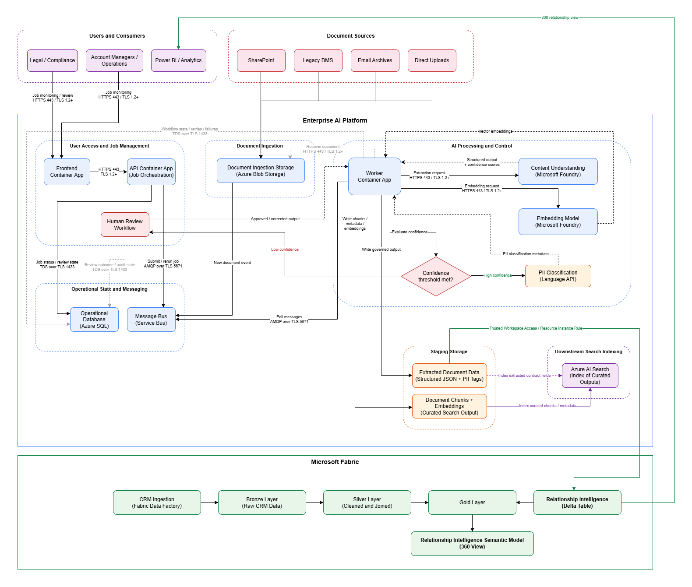
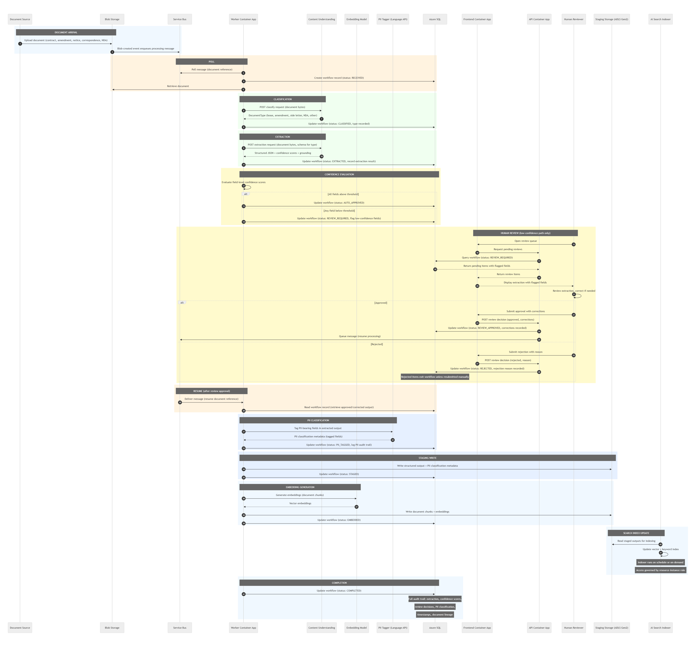

# UC2: Document Intelligence - Reference Architecture

**Status:** Draft
**Date:** 20/03/2026 (last updated)
**Repository:** `use-cases/uc2-document-intelligence/reference-architecture.md`
**Platform dependency:** This use case deploys on the shared Enterprise AI Platform. See the [Enterprise AI Platform reference architecture](../../platform/reference-architecture.md).

---

> **Note:** This architecture is actively evolving. Diagrams, workflows, 
> and component details reflect current design decisions and will be 
> refined as the system is built and validated against production 
> constraints. Structural changes will be captured in updated ADRs.

---

## Context

UC2 addresses a common enterprise problem in document-heavy organisations: business-critical information is spread across contracts, amendments, side letters, NDAs, notices, correspondence, and related document sets across multiple systems, with no governed way to extract, structure, review, and operationalise it.

The use case is not limited to a single document type. It is designed for document intelligence across relationship-relevant enterprise documents where the organisation needs more than storage and search. It needs structured outputs, confidence-based control, human review where required, and reusable downstream artefacts for analytics and retrieval. One example is building a governed view of the contractual relationship with a given client from the underlying document estate and related enterprise data. But that is one application of a broader capability designed to support any document-intensive domain.

The primary outcome of UC2 is governed structured output derived from source documents. That output supports downstream use in Microsoft Fabric and Azure AI Search, but the core value of the use case is not chat or retrieval. It is the controlled transformation of fragmented documents into auditable, reusable, production-grade data.

This document describes the use-case-specific architecture only. It inherits the runtime, network, identity, encryption, monitoring, and shared AI platform assumptions defined in the Enterprise AI Platform reference architecture.

---

## Scope

### In scope

- Document ingestion from approved enterprise sources
- Event-driven dispatch of document processing
- Document classification across supported document types
- Structured extraction using defined schemas
- Confidence-based workflow routing
- Human review for low-confidence outputs
- PII classification of accepted structured outputs
- Persistence of workflow state and audit trail
- Persistence of governed structured outputs to staging
- Embedding generation for downstream indexed outputs
- Downstream Azure AI Search indexing of curated outputs
- Fabric consumption of staged outputs for relationship-oriented data products

### Out of scope

- Ad hoc conversational querying over indexed content (UC1: Chat with Data)
- Contract comparison and redline delta analysis (UC3)
- Audit-assistant and audit-preparation workflows (UC4)
- Formal legal interpretation or legal sign-off
- Autonomous approval of extracted outputs without human oversight
- Client-specific network topology, landing zone implementation, or private endpoint design
- Infrastructure-as-code modules, deployment pipelines, and runbooks
- Detailed database, queue, or storage schema design
- Detailed Microsoft Purview taxonomy, DLP rules, or retention policy design
- Consumer-specific downstream access-control implementation such as Fabric row-level security policy definitions

---

## Design Goals

- **Transform fragmented documents into governed structured outputs.** The architecture must turn document content into reusable data rather than stopping at storage or manual review.
- **Keep quality control explicit.** Confidence evaluation is part of the workflow, not an afterthought. Low-confidence outputs are routed to human review before operationalisation.
- **Preserve durable operational truth.** Workflow state, review status, retries, failures, and audit history are stored in Azure SQL, not inferred from queue state.
- **Separate extraction from downstream consumption.** Structured outputs, embeddings, indexing, and analytics are distinct concerns with explicit handoff points.
- **Support regulated operation.** Human review, auditability, and PII-aware output classification are architectural controls, not documentation-only controls.
- **Enable reuse across analytics and retrieval.** The same governed staged outputs support both Fabric analytics and downstream search indexing without duplicating the pipeline.
- **Operate continuously.** The default operating model is event-driven processing, not one-off batch migration.

---

## Relationship to the Shared Platform

UC2 is not a standalone system. It is implemented on top of the Enterprise AI Platform and inherits its baseline controls and operating assumptions.

UC2 reuses the platform's:

- Azure Container Apps runtime model
- Azure SQL operational state store
- Azure Service Bus asynchronous dispatch model
- Document Ingestion Storage and Staging Storage patterns
- Microsoft Foundry AI service integration
- Azure AI Search integration model
- Identity-first access model using managed identities
- Private-by-default networking posture
- Data protection baseline, including CMK/MMK decisions
- Observability and audit baseline
- Microsoft Fabric integration model

This document does not restate those shared platform decisions. It explains how UC2 uses them.

UC2 uses the Foundry-hosted Language API for PII detection. This is not a separate service dependency. PII detection is accessed through the same Foundry resource, private endpoint, and managed identity used by Content Understanding and the embedding model. No additional infrastructure provisioning is required beyond the platform baseline.

Where UC2 introduces use-case-specific behaviour, such as confidence-based review, PII classification after accepted extraction output, and staged output reuse for both Fabric and search indexing, those behaviours are documented here.

For the shared infrastructure topology, see the [Enterprise AI Platform reference architecture](../../platform/reference-architecture.md).

---

## Architecture: Data Flow View

The Data Flow View is the primary architecture diagram for UC-2. It shows the major processing components, control points, staging outputs, and downstream consumers.

Documents arrive from approved sources into Document Ingestion Storage. A blob-created event enqueues a processing message onto Service Bus. The Worker Container App consumes messages from the queue and orchestrates classification, extraction, confidence evaluation, human review, PII classification, staging writes, and embedding generation. Azure AI Search indexes curated outputs downstream. Microsoft Fabric consumes staged structured data for the relationship intelligence view. Azure AI Search is a downstream consumer of curated outputs, not the primary control plane for the use case.

---

## Workflow

The UC-2 workflow is event-driven and orchestrated by the Worker Container App with Azure SQL as the durable source of operational truth.

A document arrives in Document Ingestion Storage from an approved source. The document may be a contract, amendment, notice, correspondence, NDA, or another supported business document.

A blob-created event enqueues a processing message onto Azure Service Bus. This decouples ingestion from processing and allows retry and resumability.

The Worker Container App polls the message from the queue, creates a workflow record in Azure SQL with status RECEIVED, and retrieves the source document.

The Worker classifies the document using Content Understanding. The resulting document type is recorded in Azure SQL with status CLASSIFIED.

The Worker submits an extraction request to Content Understanding using the schema appropriate for the classified document type. The extraction result returns structured JSON, confidence scores, and grounded output references. Azure SQL is updated with status EXTRACTED.

The Worker evaluates field-level confidence against the configured thresholds. If all required fields meet threshold, the workflow proceeds automatically. If any required fields are below threshold, Azure SQL is updated to REVIEW_REQUIRED and the workflow pauses pending human review.

For low-confidence outputs, the reviewer enters through the Frontend and API Container Apps to access the review queue. Pending review items are read from Azure SQL, including flagged fields and prior extraction output.

The reviewer either approves with corrections or rejects. If approved, Azure SQL is updated to REVIEW_APPROVED, corrections are recorded, and a resume-processing message is queued. If rejected, Azure SQL is updated to REJECTED and the item exits the workflow unless resubmitted manually.

On approved items, the Worker resumes processing by reading the workflow record and retrieving the accepted structured output.

The Worker calls Azure AI Language to classify PII-bearing fields in the accepted structured output. This does not redact the output. It identifies PII-bearing fields and produces classification metadata for downstream governance. Azure SQL is updated to PII_CLASSIFIED.

The Worker writes governed structured output to Staging Storage. This output includes structured extraction results plus PII classification metadata. Azure SQL is updated to STAGED.

The Worker separately generates embeddings for document chunks using the Foundry embedding model. Chunks, metadata, and embeddings are written to Staging Storage. Azure SQL is updated to EMBEDDED.

Azure AI Search indexes curated outputs downstream. The indexer reads staged content via a resource instance rule on its configured schedule.

Microsoft Fabric consumes staged structured outputs via Trusted Workspace Access into the Relationship Intelligence Delta Table. This joins with enterprise data that has already progressed through the Fabric medallion architecture to Gold. The resulting Relationship Intelligence Semantic Model provides the governed analytics view consumed by Power BI.

The workflow completes with Azure SQL updated to COMPLETED, preserving the full operational and audit trail

The sequence below shows the end-to-end operational lifecycle with explicit status transitions, human review interaction, and audit trail.

---

## Components

### Frontend Container App

Provides the operational user interface for job monitoring and human review. In UC-2 it is not a retrieval or RAG interface. Its role is to expose job status, pending review items, failures, and user actions such as approval, correction, and rerun. The Frontend and API Container Apps exist to serve the UC-2 document processing workflow. They are not a general-purpose application layer. Use cases requiring conversational or query interfaces, such as UC-1, are expected to use platform-native delivery channels such as Copilot Studio or Fabric Data Agents rather than extending these components.

### API Container App

Provides the synchronous application interface required for operational interaction with the UC-2 workflow. It retrieves workflow status, returns pending review items, accepts review decisions, and submits or reruns jobs through the message bus. It is not intended as a general-purpose consumption API for broader query or conversational use cases.

### Worker Container App

Owns the orchestration of the asynchronous document processing workflow. It retrieves documents, calls classification and extraction services, evaluates confidence, resumes approved workflows, coordinates PII classification and embeddings, writes outputs, and updates operational state in Azure SQL.

### Content Understanding (Microsoft Foundry)

Performs document classification and structured extraction. It returns typed outputs, confidence signals, and grounded extraction results. In UC-2 it is used for extraction, not for workflow routing or decision-making.

### Embedding Model (Microsoft Foundry)

Generates vector embeddings for document chunks as a downstream enrichment step. It is separate from extraction and does not replace the structured output path.

### PII Classifier (Azure AI Language)

Classifies PII-bearing fields in accepted structured outputs. Its role in UC-2 is classification and metadata enrichment, not pre-extraction redaction. PII detection uses Azure AI Language, accessed through the Microsoft Foundry resource. It shares the same private endpoint, managed identity, and regional constraints as Content Understanding and the embedding model. No separate Azure AI Language resource is provisioned.

### Azure SQL Database

Stores workflow state, review state, timestamps, retries, failures, approvals, rejections, and audit trail. It is the durable operational truth of the use case.

### Azure Service Bus

Provides asynchronous dispatch and workflow resumption. It coordinates movement of work, but it is not a system of record.

### Document Ingestion Storage (Azure Blob Storage)

Stores arriving source documents prior to processing. Documents are not modified after ingestion.

### Staging Storage (ADLS Gen2)

Stores governed structured output and chunk-plus-embedding output. It is the shared handoff point for downstream consumers.

### Azure AI Search

Indexes curated document-derived outputs downstream. In UC-2 it is a consumer of staged artefacts, not the primary control plane.

### Microsoft Fabric

Consumes governed structured outputs into analytics-oriented data structures and semantic models, including the Relationship Intelligence Delta Table and Relationship Intelligence Semantic Model.

The logical architecture separates UC-2 into five layers: External Inputs, Orchestration Layer, Core Domain, Infrastructure Adapters, and External Cloud Resources. This view shows that workflow orchestration, domain logic, infrastructure adapters, and cloud resources are distinct concerns. The Worker and workflow coordinate execution. The core domain contains the logic for classification, extraction, confidence evaluation, PII classification, and embedding generation. Infrastructure adapters connect those capabilities to Azure services.

---

## Control Boundaries and Governance

UC-2 has four control boundaries that define where quality, oversight, and governance obligations sit.

### Confidence threshold boundary

Extraction does not automatically become operational output. Confidence is evaluated explicitly and determines whether the workflow proceeds automatically or requires human review. This is the first major workflow gate.

### Human review boundary

Low-confidence outputs cross into explicit human oversight. Reviewers approve, correct, or reject extraction results before the workflow can continue. This is a real operational handoff, not an implied continuation.

### PII classification boundary

PII classification occurs after the output is accepted, not before extraction. Content Understanding requires the raw document to extract parties, signatories, addresses, and obligations. Redacting PII before extraction would destroy the data the system is designed to extract. Instead, accepted outputs are enriched with PII classification metadata so downstream consumers (Fabric RLS, AI Search field-level ACLs, semantic model masking) can enforce access boundaries appropriate to their context.

### Staging boundary

Staging Storage is the governed handoff point. Only accepted structured output and derived search artefacts are written there. Downstream consumers, including Fabric and Azure AI Search, consume from this point rather than directly from raw extraction steps.

### EU AI Act

If outputs from this system are used in contexts that fall within EU AI Act high-risk categories, additional obligations may apply, including risk management, technical documentation, human oversight, and auditability. Requirements include risk management documentation, human oversight mechanisms (already present via confidence routing and human review), technical documentation, and audit logging (already present via SQL workflow state). Enforcement deadline: August 2026.

### GDPR and data residency

All processing services are deployed in an EU Azure region. Foundry model deployments use DataZone Standard EU to ensure prompts and completions remain within EU boundaries. Storage, Foundry, AI Search, AI Language, and Fabric are all EU-region-locked. Azure Policy blocks Global Standard deployments. Documents containing personal data of EU-based parties require this residency guarantee.

---

## Data and State Model

UC-2 deliberately separates raw content, workflow state, governed outputs, and downstream indexing artefacts.

### Raw documents

Stored in Document Ingestion Storage. These are the original source documents entering the workflow. Documents are not modified after ingestion.

### Workflow and review state

Stored in Azure SQL Database. This includes status progression, document classification result, review-required flags, reviewer decisions, PII audit logs, rerun and retry history, timestamps, and lineage references.

### Governed structured outputs

Stored in Staging Storage. These include extracted structured data plus PII classification metadata.

### Chunk and embedding outputs

Also stored in Staging Storage. These support downstream indexing and retrieval scenarios.

### Indexed search artefacts

Stored in Azure AI Search. These are derived from curated outputs and are downstream consumers of the UC-2 pipeline.

### Relationship-oriented analytics outputs

Materialised in Microsoft Fabric through the Relationship Intelligence Delta Table and downstream Relationship Intelligence Semantic Model.

---

## Assumptions and Constraints

### Assumptions

- Documents arrive through approved ingestion paths on the shared platform
- Supported document types evolve over time
- Source document quality varies by age, format, and origin
- Downstream analytics and retrieval consumers use governed staged outputs rather than raw extraction responses
- The use case runs inside the shared platform runtime and inherits its controls

### Constraints

- Confidence thresholds are not optional; they are part of the operating model
- Low-confidence outputs require human review before operationalisation
- Durable operational truth is in Azure SQL, not in Service Bus
- The queue coordinates work but does not define final state
- PII classification quality depends on the accepted extraction output and the capabilities of the classification service
- Linking outputs to canonical customer identifiers depends on the availability and quality of upstream CRM or master data
- Fabric and Azure AI Search consume outputs through approved downstream patterns only
- The use case does not define downstream consumer access-control policy implementation

---

## Alternatives Considered

**Direct document-to-search pipeline without structured staging.** Rejected because it eliminates the governed structured output that Fabric and other downstream systems need. Search alone does not produce the relationship-oriented analytics view.

**Extraction without human review.** Rejected because it would not survive regulated scrutiny where extracted data influences legal, financial, or commercial decisions.

**Queue-only workflow state.** Rejected because queues are transient dispatch mechanisms. Durable operational state requires a relational store with query, reporting, and audit capability.

**Collapsing extraction and embeddings into one opaque AI step.** Rejected because they serve different purposes, use different AI capabilities, and produce different output types. Keeping them separate preserves operational clarity and control.

---

## Extending the Use Case

UC2 can be extended without redesigning the shared platform.

Adding new document types requires new or refined extraction schemas and classification handling. Stronger customer/entity resolution can be introduced where upstream CRM or master data is available. Additional downstream consumers can be added to Staging Storage where the access pattern remains governed. Future retrieval-oriented use cases, including UC1, may consume indexed outputs produced by UC2. Future document-centric use cases such as comparison (UC3) and audit preparation (UC4) can reuse parts of the extraction, review, and staging model defined here.

A new use-case architecture is warranted when the autonomy boundary, consumer pattern, or regulatory handling materially changes.

---

## Related ADRs

| ADR     | Title                                          | Status   | Relevance to UC2                                                                                                                             |
| ------- | ---------------------------------------------- | -------- | -------------------------------------------------------------------------------------------------------------------------------------------- |
| ADR-001 | Processing Paradigm                            | Accepted | Confidence-based routing, human review boundaries, and controlled AI execution ownership.                                                    |
| ADR-002 | Runtime Platform and EU Region Selection       | Accepted | Container Apps runtime, Service Bus dispatch, Azure SQL workflow state, and EU deployment constraints.                                      |
| ADR-003 | Network Isolation and Data Residency Enforcement | Accepted | Private endpoints for all PaaS dependencies, resource instance rule for AI Search indexer and Fabric TWA to Staging Storage.               |
| ADR-004 | Identity, Authentication, and Authorisation    | Accepted | Managed identities for Worker to Foundry, Storage, SQL, and Service Bus. No shared keys. PII detection uses the existing Foundry identity path. |
| ADR-005 | Data Protection                                | Accepted | CMK on Staging Storage, Document Ingestion Storage, Azure SQL, TLS 1.2+, and EU-region enforcement.                                         |
| ADR-006 | Observability and Operational Model            | Planned  | Incident response, alerting, auditability, backup and restore. Scope defined; content pending.                                              |
